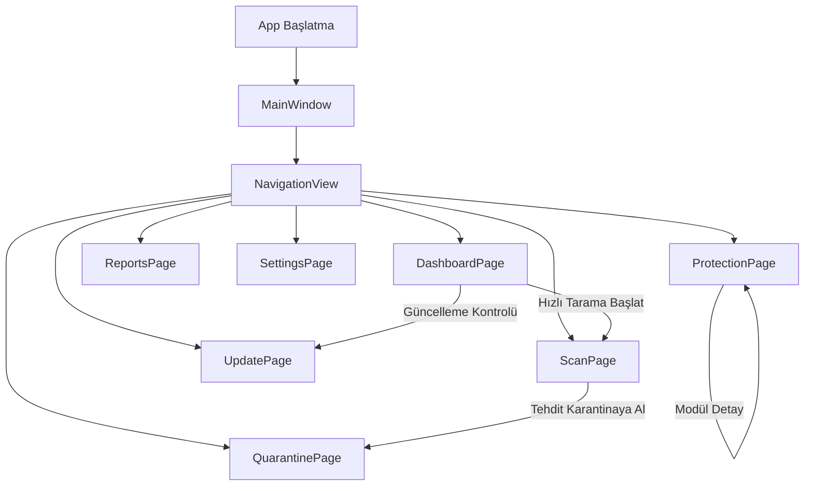
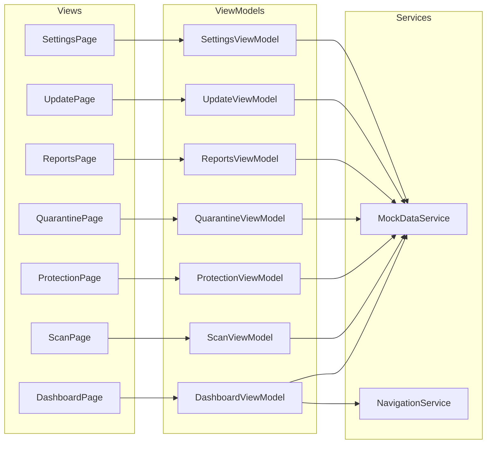

# DefenderUI — WinUI 3 Antivirüs Frontend Mimari Dokümanı

> **Uygulama Adı:** DefenderUI  
> **Namespace:** `DefenderUI`  
> **Platform:** Windows App SDK / WinUI 3  
> **Runtime:** .NET 8+, C#  
> **Mimari:** MVVM (Model-View-ViewModel)  
> **Veri Kaynağı:** Mock Data (backend yok)  
> **Commit Kuralı:** Her 3 dosyada bir git commit atılacak

---

## İçindekiler

1. [Proje Yapısı](#1-proje-yapısı)
2. [Sayfa Listesi ve İçerikleri](#2-sayfa-listesi-ve-içerikleri)
3. [Navigasyon Yapısı](#3-navigasyon-yapısı)
4. [Tema ve Stil Yapısı](#4-tema-ve-stil-yapısı)
5. [Mock Data Yapısı](#5-mock-data-yapısı)
6. [Custom Control Listesi](#6-custom-control-listesi)
7. [MVVM Yapısı](#7-mvvm-yapısı)
8. [NuGet Bağımlılıkları](#8-nuget-bağımlılıkları)
9. [Navigasyon Akış Diyagramı](#9-navigasyon-akış-diyagramı)
10. [Geliştirme Kuralları](#10-geliştirme-kuralları)

---

## 1. Proje Yapısı

### Çözüm Dosya Ağacı

```
DefenderUI/
├── DefenderUI.sln
├── DefenderUI/
│   ├── DefenderUI.csproj
│   ├── App.xaml
│   ├── App.xaml.cs
│   ├── MainWindow.xaml
│   ├── MainWindow.xaml.cs
│   ├── Package.appxmanifest
│   │
│   ├── Assets/
│   │   ├── Logo/
│   │   │   ├── DefenderUI_Logo.png
│   │   │   ├── StoreLogo.png
│   │   │   ├── Square44x44Logo.png
│   │   │   ├── Square150x150Logo.png
│   │   │   └── Wide310x150Logo.png
│   │   ├── Icons/
│   │   │   ├── dashboard.svg
│   │   │   ├── scan.svg
│   │   │   ├── protection.svg
│   │   │   ├── quarantine.svg
│   │   │   ├── reports.svg
│   │   │   ├── update.svg
│   │   │   └── settings.svg
│   │   └── Images/
│   │       ├── shield_ok.png
│   │       ├── shield_warning.png
│   │       └── shield_critical.png
│   │
│   ├── Styles/
│   │   ├── Colors.xaml
│   │   ├── Typography.xaml
│   │   ├── ControlStyles.xaml
│   │   ├── CardStyles.xaml
│   │   └── AppStyles.xaml          (tüm stil dosyalarını birleştiren merged dict)
│   │
│   ├── Models/
│   │   ├── ThreatInfo.cs
│   │   ├── ScanResult.cs
│   │   ├── ProtectionModule.cs
│   │   ├── QuarantineItem.cs
│   │   ├── ActivityLogEntry.cs
│   │   ├── UpdateInfo.cs
│   │   ├── ReportData.cs
│   │   ├── KpiData.cs
│   │   └── AppSettings.cs
│   │
│   ├── ViewModels/
│   │   ├── DashboardViewModel.cs
│   │   ├── ScanViewModel.cs
│   │   ├── ProtectionViewModel.cs
│   │   ├── QuarantineViewModel.cs
│   │   ├── ReportsViewModel.cs
│   │   ├── UpdateViewModel.cs
│   │   └── SettingsViewModel.cs
│   │
│   ├── Views/
│   │   ├── DashboardPage.xaml
│   │   ├── DashboardPage.xaml.cs
│   │   ├── ScanPage.xaml
│   │   ├── ScanPage.xaml.cs
│   │   ├── ProtectionPage.xaml
│   │   ├── ProtectionPage.xaml.cs
│   │   ├── QuarantinePage.xaml
│   │   ├── QuarantinePage.xaml.cs
│   │   ├── ReportsPage.xaml
│   │   ├── ReportsPage.xaml.cs
│   │   ├── UpdatePage.xaml
│   │   ├── UpdatePage.xaml.cs
│   │   ├── SettingsPage.xaml
│   │   └── SettingsPage.xaml.cs
│   │
│   ├── Controls/
│   │   ├── StatusCard.xaml
│   │   ├── StatusCard.xaml.cs
│   │   ├── KpiCard.xaml
│   │   ├── KpiCard.xaml.cs
│   │   ├── ThreatItem.xaml
│   │   ├── ThreatItem.xaml.cs
│   │   ├── ProtectionToggleItem.xaml
│   │   ├── ProtectionToggleItem.xaml.cs
│   │   ├── ActivityLogItem.xaml
│   │   ├── ActivityLogItem.xaml.cs
│   │   ├── ScanProgressRing.xaml
│   │   ├── ScanProgressRing.xaml.cs
│   │   ├── SecurityScoreRing.xaml
│   │   └── SecurityScoreRing.xaml.cs
│   │
│   ├── Services/
│   │   ├── INavigationService.cs
│   │   ├── NavigationService.cs
│   │   ├── IMockDataService.cs
│   │   └── MockDataService.cs
│   │
│   ├── Helpers/
│   │   ├── RelayCommandHelper.cs
│   │   ├── EnumToBrushConverter.cs
│   │   ├── BoolToVisibilityConverter.cs
│   │   ├── DateTimeFormatConverter.cs
│   │   ├── RiskLevelToColorConverter.cs
│   │   └── InverseBoolConverter.cs
│   │
│   └── Converters/
│       (Helpers klasöründe tanımlanan converter'lar yeterli;
│        ileride artarsa buraya taşınabilir)
```

---

## 2. Sayfa Listesi ve İçerikleri

### 2.1 DashboardPage

Ana kontrol paneli. Uygulamanın açılış sayfası.

| Bölüm | Açıklama |
|---|---|
| **Koruma Durumu Hero Kartı** | Kalkan ikonu + "Cihazınız korunuyor" / "Tehdit algılandı" mesajı. Arka plan rengi duruma göre değişir (yeşil/amber/kırmızı). |
| **KPI Kartları** | 4 adet kart — Taranan Dosya, Engellenen Tehdit, Karantina Öğesi, Güvenlik Skoru. Her kartta ikon + sayı + etiket. |
| **Hızlı Erişim Butonları** | Hızlı Tarama Başlat, Tam Tarama, Güncelleme Kontrolü. |
| **Gerçek Zamanlı Koruma Paneli** | Gerçek zamanlı korumanın açık/kapalı durumu, son aktivite özeti. |
| **Son Tarama Bilgisi** | Son tarama türü, tarihi, süresi, sonucu. |
| **Güncelleme Durumu** | Veritabanı sürümü, son güncelleme tarihi, güncel mi bilgisi. |
| **Aktivite Log Paneli** | Son 10 aktivite — tarih, tür, açıklama, seviye (info/warning/critical). |
| **Uyarılar** | InfoBar bileşeni ile kritik uyarılar (varsa). |

### 2.2 ScanPage

Tarama yönetimi ve ilerleme izleme.

| Bölüm | Açıklama |
|---|---|
| **Tarama Türü Seçimi** | 4 kart: Quick Scan, Full Scan, Custom Scan, USB Scan. Her kartta ikon, başlık, açıklama, "Başlat" butonu. |
| **Tarama İlerleme** | Dairesel progress ring + yüzde, taranan dosya sayısı, geçen süre, tahmini kalan süre, o an taranan dosya yolu. |
| **Bulunan Tehditler Listesi** | Tehdit adı, dosya yolu, risk seviyesi (badge), önerilen aksiyon. |
| **Kontrol Butonları** | Pause, Stop, Continue butonları. Tarama durumuna göre aktif/pasif. |

### 2.3 ProtectionPage

Koruma modüllerinin yönetimi.

| Modül | Açıklama |
|---|---|
| **Real-time Protection** | Gerçek zamanlı dosya tarama. Toggle + durum etiketi + açıklama. |
| **Web Protection** | Zararlı URL engelleme. Toggle + durum + istatistik. |
| **File Protection** | Dosya sistemi koruması. Toggle + durum. |
| **Ransomware Protection** | Fidye yazılım koruması. Toggle + korunan klasör listesi. |
| **Email Protection** | E-posta ek tarama. Toggle + durum. |
| **Network Protection** | Ağ trafiği izleme. Toggle + durum. |

Her modül bir `ProtectionToggleItem` custom control ile gösterilir.

### 2.4 QuarantinePage

Karantinaya alınan dosyaların yönetimi.

| Sütun | Açıklama |
|---|---|
| **Threat Name** | Tespit edilen tehdidin adı |
| **File Path** | Orijinal dosya yolu |
| **Detection Date** | Tespit tarihi |
| **Risk Level** | Low / Medium / High / Critical — renkli badge |
| **Actions** | Restore, Delete, Details butonları |

Üst kısımda: arama kutusu, risk seviyesine göre filtreleme, toplu silme butonu.

### 2.5 ReportsPage

İstatistik ve trend raporları.

| Bölüm | Açıklama |
|---|---|
| **Zaman Filtresi** | SegmentedControl: 7 Gün / 30 Gün / 90 Gün |
| **Trend Grafikleri** | Günlük tehdit sayısı çizgi grafiği, tarama istatistikleri bar grafiği. |
| **İstatistik Kartları** | Toplam tarama, toplam tehdit, ortalama tarama süresi, en sık tehdit türü. |
| **Tehdit Dağılımı** | Tehdit türlerine göre pasta/donut grafik. |

> Not: Grafikler için `WinUI Community Toolkit` veya `LiveCharts2` kullanılabilir. İlk aşamada basit bar/progress gösterimleri ile mock edilebilir.

### 2.6 UpdatePage

Güncelleme yönetimi.

| Bölüm | Açıklama |
|---|---|
| **Güncelleme Durumu** | Güncel / Güncelleme Mevcut hero kartı. |
| **Versiyon Bilgileri** | Uygulama versiyonu, veritabanı versiyonu, son kontrol tarihi. |
| **Güncelle Butonu** | Manuel güncelleme tetikleme. Progress bar ile ilerleme. |
| **Güncelleme Geçmişi** | Son güncellemelerin listesi — tarih, tür, versiyon, durum. |

### 2.7 SettingsPage

Kategorili ayarlar sayfası. Sol tarafta kategori listesi, sağ tarafta detay paneli.

| Kategori | İçerik |
|---|---|
| **General** | Dil seçimi, başlangıçta çalıştır, sistem tepsisinde çalış. |
| **Protection** | Koruma hassasiyet seviyesi, heuristic analiz açık/kapalı. |
| **Notifications** | Tehdit bildirimi, tarama tamamlandı bildirimi, güncelleme bildirimi toggle'ları. |
| **Update** | Otomatik güncelleme aralığı, beta güncellemeler. |
| **Privacy** | Anonim kullanım verisi gönderimi. |
| **Appearance** | Tema seçimi (Dark/Light/System), accent renk seçimi. |
| **Scheduled Scans** | Zamanlanmış tarama günü, saati, türü. |
| **Exclusions** | Tarama dışı dosya/klasör/uzantı listesi, ekleme/kaldırma. |

---

## 3. Navigasyon Yapısı

### NavigationView Yapılandırması

```
┌─────────────────────────────────────────────────┐
│  [≡]  DefenderUI                                │
├────────────┬────────────────────────────────────┤
│            │                                    │
│  🏠 Dashboard   │       [Sayfa İçeriği]        │
│  🔍 Scan        │                              │
│  🛡 Protection   │                              │
│  📦 Quarantine   │                              │
│  📊 Reports      │                              │
│  🔄 Update       │                              │
│            │                                    │
│────────────│                                    │
│  ⚙ Settings     │                              │
│            │                                    │
└────────────┴────────────────────────────────────┘
```

- **Konum:** Sol sidebar (`NavigationView` — `PaneDisplayMode="Left"`)
- **Daraltma:** Hamburger menü ile daraltılabilir (sadece ikonlar görünür)
- **Header:** DefenderUI logosu + uygulama adı
- **Footer:** Settings menü öğesi (`IsSettingsItem` veya footer'a yerleştirme)
- **Seçili Öğe:** `NavigationView.SelectedItem` ile aktif sayfa vurgulanır
- **Geçiş Animasyonu:** `Frame.Navigate()` ile `SlideFromRight` veya `EntranceNavigationTransition`

### Navigasyon Servisi

`INavigationService` arayüzü üzerinden merkezi sayfa yönlendirme:

- `NavigateTo<TPage>()` — tip güvenli navigasyon
- `GoBack()` — geri gitme
- `CanGoBack` — geri gidebilme durumu

---

## 4. Tema ve Stil Yapısı

### 4.1 Renk Paleti

#### Ana Renkler (Dark Theme Ağırlıklı)

| Token | Hex | Kullanım |
|---|---|---|
| `BackgroundPrimary` | `#0D1117` | Ana arka plan |
| `BackgroundSecondary` | `#161B22` | Kart arka planı |
| `BackgroundTertiary` | `#21262D` | Hover / elevated surfaces |
| `SurfaceBorder` | `#30363D` | Kart ve bölüm kenarlıkları |
| `TextPrimary` | `#F0F6FC` | Ana metin rengi |
| `TextSecondary` | `#8B949E` | İkincil / açıklama metinleri |
| `TextMuted` | `#484F58` | Devre dışı / placeholder |

#### Vurgu Renkleri

| Token | Hex | Kullanım |
|---|---|---|
| `AccentPrimary` | `#00B4D8` | Ana vurgu — teal/mavi, butonlar, aktif öğeler |
| `AccentPrimaryHover` | `#0096C7` | Hover durumu |
| `StatusSuccess` | `#2EA043` | Başarılı / korumalı durumlar |
| `StatusWarning` | `#D29922` | Uyarı durumları |
| `StatusCritical` | `#F85149` | Kritik / tehdit durumları |
| `StatusInfo` | `#58A6FF` | Bilgi mesajları |

### 4.2 Tipografi

| Stil | Font | Boyut | Weight | Kullanım |
|---|---|---|---|---|
| `DisplayLarge` | Segoe UI Variable | 32px | SemiBold | Hero başlıklar |
| `TitleLarge` | Segoe UI Variable | 24px | SemiBold | Sayfa başlıkları |
| `TitleMedium` | Segoe UI Variable | 20px | SemiBold | Bölüm başlıkları |
| `BodyLarge` | Segoe UI Variable | 16px | Regular | Ana içerik metni |
| `BodyMedium` | Segoe UI Variable | 14px | Regular | Standart metin |
| `BodySmall` | Segoe UI Variable | 12px | Regular | Alt metin / etiket |
| `Caption` | Segoe UI Variable | 11px | Regular | Zaman damgası / notlar |

### 4.3 ResourceDictionary Organizasyonu

| Dosya | İçerik |
|---|---|
| `Colors.xaml` | Tüm renk tokenları — `SolidColorBrush` kaynakları |
| `Typography.xaml` | Metin stilleri — `TextBlock` style tanımları |
| `ControlStyles.xaml` | Button, ToggleSwitch, ProgressBar, TextBox gibi kontrollerin override stilleri |
| `CardStyles.xaml` | Kart bileşenlerinin ortak stili — border radius, shadow, padding |
| `AppStyles.xaml` | MergedDictionaries ile yukarıdaki tüm dosyaları birleştirir |

`App.xaml` dosyasında `AppStyles.xaml` referans edilerek tüm stiller uygulama genelinde erişilebilir hale getirilir.

### 4.4 Kart Tasarım Kuralları

- **Border Radius:** 8px
- **Padding:** 16px (iç boşluk)
- **Background:** `BackgroundSecondary`
- **Border:** 1px `SurfaceBorder`
- **Shadow:** Hafif elevation (opsiyonel, WinUI shadow desteği ile)
- **Spacing:** Kartlar arası 12px gap

---

## 5. Mock Data Yapısı

### 5.1 Model Sınıfları

#### `ThreatInfo`
```
- Id: string
- Name: string
- Description: string
- FilePath: string
- DetectionDate: DateTime
- RiskLevel: RiskLevel (enum: Low, Medium, High, Critical)
- ThreatType: string (Trojan, Adware, Ransomware, PUP, vb.)
- Status: ThreatStatus (enum: Detected, Quarantined, Removed, Allowed)
```

#### `ScanResult`
```
- ScanId: string
- ScanType: ScanType (enum: Quick, Full, Custom, USB)
- StartTime: DateTime
- EndTime: DateTime?
- Duration: TimeSpan
- TotalFilesScanned: int
- ThreatsFound: int
- Status: ScanStatus (enum: InProgress, Completed, Paused, Cancelled)
- Threats: List<ThreatInfo>
- CurrentFile: string (tarama sırasında gösterilen dosya yolu)
- ProgressPercentage: double
```

#### `ProtectionModule`
```
- Id: string
- Name: string
- Description: string
- IconGlyph: string
- IsEnabled: bool
- Status: string (Active, Disabled, Error)
- LastActivity: DateTime
- StatValue: string (ör: "1,245 blocked")
```

#### `QuarantineItem`
```
- Id: string
- ThreatName: string
- OriginalFilePath: string
- QuarantineDate: DateTime
- RiskLevel: RiskLevel
- FileSize: long
- ThreatType: string
```

#### `ActivityLogEntry`
```
- Id: string
- Timestamp: DateTime
- EventType: ActivityEventType (enum: ThreatDetected, ScanCompleted, UpdateInstalled, ProtectionChanged, SystemEvent)
- Title: string
- Description: string
- Severity: Severity (enum: Info, Warning, Critical)
```

#### `UpdateInfo`
```
- CurrentAppVersion: string
- CurrentDbVersion: string
- LatestAppVersion: string
- LatestDbVersion: string
- LastCheckDate: DateTime
- IsUpToDate: bool
- UpdateHistory: List<UpdateHistoryItem>
```

#### `UpdateHistoryItem`
```
- Date: DateTime
- Type: string (Database, Application, Definitions)
- FromVersion: string
- ToVersion: string
- Status: string (Success, Failed)
```

#### `ReportData`
```
- Period: int (7, 30, 90 gün)
- DailyThreatCounts: List<DailyCount>
- DailyScanCounts: List<DailyCount>
- TotalScans: int
- TotalThreats: int
- AverageScanDuration: TimeSpan
- MostCommonThreatType: string
- ThreatDistribution: Dictionary<string, int>
```

#### `DailyCount`
```
- Date: DateTime
- Count: int
```

#### `KpiData`
```
- Title: string
- Value: string
- IconGlyph: string
- Trend: string (up, down, stable)
- Description: string
```

#### `AppSettings`
```
- Language: string
- RunAtStartup: bool
- MinimizeToTray: bool
- Theme: AppTheme (enum: Dark, Light, System)
- AccentColor: string
- ProtectionSensitivity: int (1-5)
- HeuristicAnalysis: bool
- NotifyOnThreat: bool
- NotifyOnScanComplete: bool
- NotifyOnUpdate: bool
- AutoUpdateInterval: int (saat)
- BetaUpdates: bool
- SendAnonymousData: bool
- ScheduledScanDay: DayOfWeek
- ScheduledScanTime: TimeSpan
- ScheduledScanType: ScanType
- ExcludedFiles: List<string>
- ExcludedFolders: List<string>
- ExcludedExtensions: List<string>
```

### 5.2 MockDataService

`IMockDataService` arayüzü ve `MockDataService` uygulaması:

```
interface IMockDataService
{
    // Dashboard
    KpiData[] GetDashboardKpis();
    List<ActivityLogEntry> GetRecentActivity(int count);
    bool GetRealTimeProtectionStatus();
    ScanResult GetLastScanResult();
    UpdateInfo GetUpdateStatus();
    int GetSecurityScore();

    // Scan
    Task<ScanResult> SimulateScanAsync(ScanType type, IProgress<ScanResult> progress);

    // Protection
    List<ProtectionModule> GetProtectionModules();
    void ToggleProtectionModule(string moduleId, bool isEnabled);

    // Quarantine
    List<QuarantineItem> GetQuarantineItems();
    void RestoreItem(string itemId);
    void DeleteItem(string itemId);

    // Reports
    ReportData GetReportData(int periodDays);

    // Update
    UpdateInfo GetUpdateInfo();
    Task SimulateUpdateAsync(IProgress<double> progress);

    // Settings
    AppSettings GetSettings();
    void SaveSettings(AppSettings settings);
}
```

`MockDataService` sınıfı statik olarak oluşturulmuş gerçekçi veriler döndürür. Tarama simülasyonu `Task.Delay` ile async olarak yapılır.

---

## 6. Custom Control Listesi

### 6.1 StatusCard

Koruma durumu hero kartı.

| Property | Tip | Açıklama |
|---|---|---|
| `Status` | `ProtectionStatus` enum | Protected, Warning, Critical |
| `Title` | `string` | Durum başlığı |
| `Subtitle` | `string` | Durum açıklaması |
| `IconGlyph` | `string` | Kalkan ikonu |

Arka plan rengi `Status` değerine göre gradient olarak değişir.

### 6.2 KpiCard

Anahtar performans gösterge kartı.

| Property | Tip | Açıklama |
|---|---|---|
| `Title` | `string` | KPI etiketi |
| `Value` | `string` | Sayısal değer |
| `IconGlyph` | `string` | Segoe Fluent Icons glyph |
| `Trend` | `string` | Trend yönü |

### 6.3 ThreatItem

Tehdit listesi öğesi.

| Property | Tip | Açıklama |
|---|---|---|
| `ThreatName` | `string` | Tehdit adı |
| `FilePath` | `string` | Dosya yolu |
| `RiskLevel` | `RiskLevel` | Renk kodlu badge |
| `Action` | `ICommand` | Aksiyon komutu |

### 6.4 ProtectionToggleItem

Koruma modülü toggle kartı.

| Property | Tip | Açıklama |
|---|---|---|
| `ModuleName` | `string` | Modül adı |
| `Description` | `string` | Açıklama |
| `IconGlyph` | `string` | Modül ikonu |
| `IsEnabled` | `bool` | Toggle durumu (two-way binding) |
| `StatusText` | `string` | Durum metni |
| `StatValue` | `string` | İstatistik değeri |

### 6.5 ActivityLogItem

Aktivite log satırı.

| Property | Tip | Açıklama |
|---|---|---|
| `Timestamp` | `DateTime` | Zaman damgası |
| `Title` | `string` | Olay başlığı |
| `Description` | `string` | Açıklama |
| `Severity` | `Severity` | Info/Warning/Critical — ikon ve renk |

### 6.6 ScanProgressRing

Tarama ilerleme göstergesi.

| Property | Tip | Açıklama |
|---|---|---|
| `Progress` | `double` | 0-100 arası ilerleme |
| `Status` | `string` | Durum metni |
| `ScannedFiles` | `int` | Taranan dosya sayısı |
| `CurrentFile` | `string` | O an taranan dosya |
| `ElapsedTime` | `TimeSpan` | Geçen süre |

Özel dairesel progress ring + ortasında yüzde gösterimi.

### 6.7 SecurityScoreRing

Güvenlik skor göstergesi (Dashboard).

| Property | Tip | Açıklama |
|---|---|---|
| `Score` | `int` | 0-100 arası skor |
| `Label` | `string` | Etiket |

Renkli dairesel gösterge: 0-40 kırmızı, 41-70 amber, 71-100 yeşil.

---

## 7. MVVM Yapısı

### 7.1 Base Yapı

`CommunityToolkit.Mvvm` paketi kullanılır:

- **ObservableObject** — `INotifyPropertyChanged` implementasyonu
- **RelayCommand / AsyncRelayCommand** — `ICommand` implementasyonu
- **ObservableProperty attribute** — property tanımı kısaltması
- **RelayCommand attribute** — komut tanımı kısaltması

### 7.2 ViewModel Detayları

#### DashboardViewModel

```
Properties:
  - ProtectionStatus: ProtectionStatus
  - SecurityScore: int
  - KpiItems: ObservableCollection<KpiData>
  - RecentActivities: ObservableCollection<ActivityLogEntry>
  - LastScanResult: ScanResult
  - UpdateStatus: UpdateInfo
  - IsRealTimeProtectionEnabled: bool
  - Alerts: ObservableCollection<string>

Commands:
  - StartQuickScanCommand: AsyncRelayCommand
  - StartFullScanCommand: AsyncRelayCommand
  - CheckUpdatesCommand: AsyncRelayCommand
  - RefreshCommand: AsyncRelayCommand
```

#### ScanViewModel

```
Properties:
  - IsScanning: bool
  - IsPaused: bool
  - CurrentScanType: ScanType
  - Progress: double
  - ScannedFileCount: int
  - CurrentFile: string
  - ElapsedTime: TimeSpan
  - EstimatedTimeRemaining: TimeSpan
  - DetectedThreats: ObservableCollection<ThreatInfo>
  - ScanResult: ScanResult

Commands:
  - StartScanCommand: AsyncRelayCommand<ScanType>
  - PauseScanCommand: RelayCommand
  - StopScanCommand: RelayCommand
  - ContinueScanCommand: RelayCommand
```

#### ProtectionViewModel

```
Properties:
  - Modules: ObservableCollection<ProtectionModule>

Commands:
  - ToggleModuleCommand: RelayCommand<ProtectionModule>
```

#### QuarantineViewModel

```
Properties:
  - Items: ObservableCollection<QuarantineItem>
  - FilteredItems: ObservableCollection<QuarantineItem>
  - SearchQuery: string
  - SelectedRiskFilter: RiskLevel?
  - SelectedItems: ObservableCollection<QuarantineItem>

Commands:
  - RestoreCommand: RelayCommand<QuarantineItem>
  - DeleteCommand: RelayCommand<QuarantineItem>
  - DeleteAllCommand: AsyncRelayCommand
  - SearchCommand: RelayCommand
```

#### ReportsViewModel

```
Properties:
  - SelectedPeriod: int (7, 30, 90)
  - ReportData: ReportData
  - DailyThreatData: ObservableCollection<DailyCount>
  - DailyScanData: ObservableCollection<DailyCount>
  - TotalScans: int
  - TotalThreats: int
  - AverageScanDuration: string
  - MostCommonThreat: string

Commands:
  - ChangePeriodCommand: RelayCommand<int>
  - ExportReportCommand: AsyncRelayCommand
```

#### UpdateViewModel

```
Properties:
  - UpdateInfo: UpdateInfo
  - IsChecking: bool
  - IsUpdating: bool
  - UpdateProgress: double
  - UpdateHistory: ObservableCollection<UpdateHistoryItem>

Commands:
  - CheckForUpdatesCommand: AsyncRelayCommand
  - InstallUpdateCommand: AsyncRelayCommand
```

#### SettingsViewModel

```
Properties:
  - Settings: AppSettings
  - SelectedCategory: string
  - Categories: List<string>
  - ExcludedFiles: ObservableCollection<string>
  - ExcludedFolders: ObservableCollection<string>
  - ExcludedExtensions: ObservableCollection<string>

Commands:
  - SaveSettingsCommand: RelayCommand
  - ResetSettingsCommand: RelayCommand
  - AddExclusionCommand: RelayCommand<string>
  - RemoveExclusionCommand: RelayCommand<string>
  - BrowseFolderCommand: AsyncRelayCommand
```

### 7.3 Dependency Injection

`App.xaml.cs` içinde `Microsoft.Extensions.DependencyInjection` ile servis kaydı:

```
Services:
  - IMockDataService → MockDataService (Singleton)
  - INavigationService → NavigationService (Singleton)
  - DashboardViewModel (Transient)
  - ScanViewModel (Transient)
  - ProtectionViewModel (Transient)
  - QuarantineViewModel (Transient)
  - ReportsViewModel (Transient)
  - UpdateViewModel (Transient)
  - SettingsViewModel (Transient)
```

---

## 8. NuGet Bağımlılıkları

| Paket | Amaç |
|---|---|
| `Microsoft.WindowsAppSDK` | WinUI 3 çatısı |
| `Microsoft.Windows.SDK.BuildTools` | Windows SDK build araçları |
| `CommunityToolkit.Mvvm` | MVVM altyapısı — ObservableObject, RelayCommand |
| `CommunityToolkit.WinUI.UI.Controls` | DataGrid, HeaderedContentControl vb. |
| `CommunityToolkit.WinUI.UI.Animations` | Sayfa geçiş ve kart animasyonları |
| `Microsoft.Extensions.DependencyInjection` | DI container |

---

## 9. Navigasyon Akış Diyagramı



### Sayfa-ViewModel-Service İlişki Diyagramı



---

## 10. Geliştirme Kuralları

### Git Commit Stratejisi

- **Her 3 dosya oluşturulduktan/değiştirildikten sonra** bir git commit atılır
- Commit mesaj formatı: `feat: add [bileşen/sayfa adı]` veya `style: add [stil dosyası adı]`
- Anlamlı ve açıklayıcı commit mesajları kullanılır

### Kodlama Standartları

- Namespace: `DefenderUI.[Katman]` (ör: `DefenderUI.ViewModels`, `DefenderUI.Models`)
- XAML dosyalarında `x:Bind` tercih edilir (`Binding` yerine — performans avantajı)
- ViewModel'lerde `[ObservableProperty]` ve `[RelayCommand]` attribute'ları kullanılır
- Tüm string sabitler için ileride lokalizasyon desteği düşünülerek `x:Uid` veya constant kullanılabilir
- Her XAML sayfası kendi `DataContext`'ini ViewModel olarak alır

### Dosya Oluşturma Sırası (Önerilen)

1. Proje iskeleti — `.csproj`, `App.xaml`, `MainWindow.xaml`, `Package.appxmanifest`
2. Stil dosyaları — `Colors.xaml`, `Typography.xaml`, `ControlStyles.xaml`, `CardStyles.xaml`, `AppStyles.xaml`
3. Model sınıfları — tüm enum ve model dosyaları
4. Servisler — `IMockDataService`, `MockDataService`, `INavigationService`, `NavigationService`
5. Helpers/Converters — tüm converter sınıfları
6. Custom Controls — `StatusCard`, `KpiCard`, `ThreatItem`, vb.
7. ViewModels — tüm ViewModel sınıfları
8. Views — tüm sayfa XAML ve code-behind dosyaları
9. DI yapılandırması — `App.xaml.cs` güncellemesi
10. Asset dosyaları — ikonlar ve görseller

---

> Bu doküman DefenderUI projesinin frontend mimari planını içermektedir. Uygulama geliştirilirken bu yapıya sadık kalınmalı ve değişiklikler bu dokümana da yansıtılmalıdır.