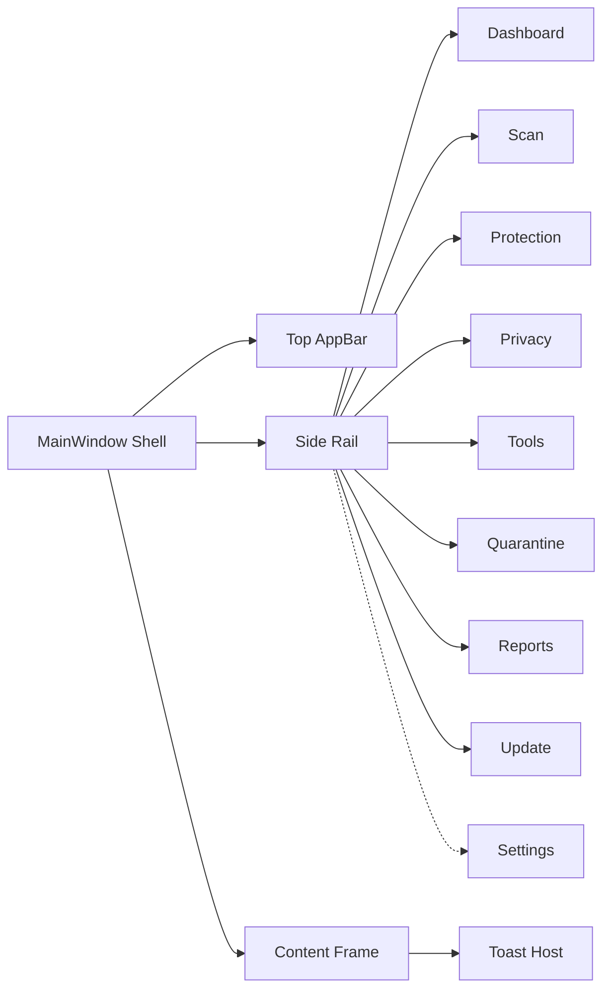
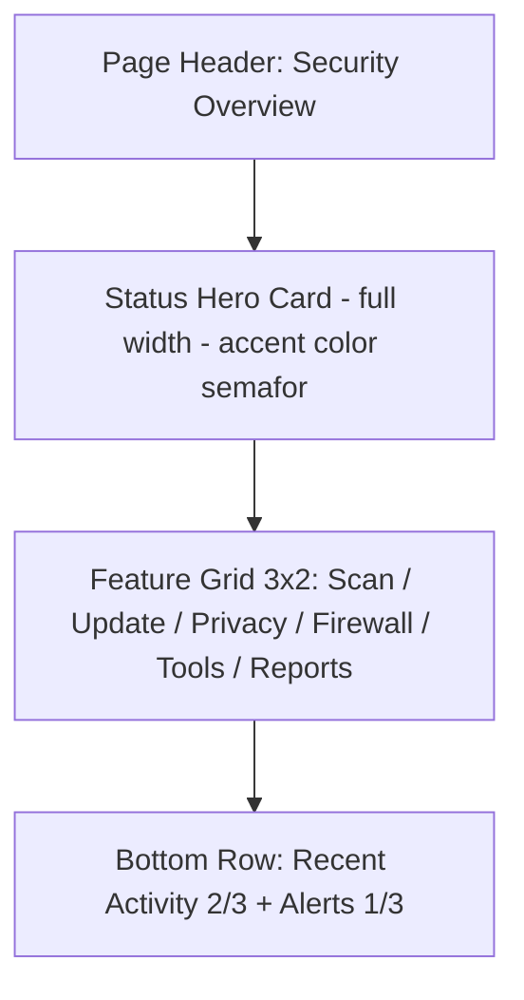
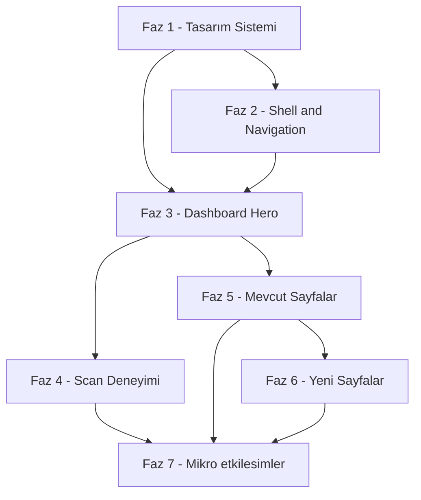

# DefenderUI — Kaspersky Tarzı Modern UI Dönüşüm Planı

> **Doküman türü:** Mimari + UI tasarım yol haritası  
> **Hedef:** DefenderUI'ı Kaspersky / Bitdefender / ESET benzeri, modern, bilgi yoğun ama sade, profesyonel bir güvenlik ürünü arayüzüne dönüştürmek  
> **Kapsam dışı:** Kod implementasyonu (bu doküman yalnızca plan ve spesifikasyondur)

---

## 0. Önemli Ön Tespit — Teknoloji Yığını

Görev tanımında proje **WPF (.NET 8)** olarak belirtilmiş; ancak kaynak kodu incelemesi farklı bir gerçeği gösteriyor:

| Kanıt | Bulgu |
|---|---|
| [`MainWindow.xaml`](MainWindow.xaml:1) içinde `<NavigationView>`, `<FontIcon Glyph="&#xE72E;"/>`, `MicaBackdrop` | **WinUI 3** (WindowsAppSDK) veya **UWP** işaretleri |
| [`App.xaml`](App.xaml:10) içinde `<XamlControlsResources xmlns="using:Microsoft.UI.Xaml.Controls" />` | WinUI 3 / UWP runtime |
| XAML'lerde `x:Bind`, `xmlns:local="using:..."` kullanımı | WinUI/UWP sözdizimi (WPF `clr-namespace:` kullanır) |
| `Image Source="ms-appx:///Assets/..."` | UWP/WinUI paket URI şeması |
| `Package.appxmanifest` dosyasının varlığı | MSIX paketleme → WinUI 3 Packaged |

**Sonuç:** Bu proje büyük olasılıkla **WinUI 3 (Windows App SDK)** tabanlı, WPF değil. Bu bilgi planın her fazını etkiler (kontrol seti, teming API'si, tema geçiş mekanizması farklıdır). Plan boyunca **"WinUI 3 varsayımı"** ile ilerleneceği, farklıysa ayarlama yapılacağı belirtilmiştir. Bu durum **Açık Sorular** bölümünde netleştirilmesi gereken ilk madde olarak tekrar geçer.

---

## 1. Hızlı Analiz — Mevcut Durum Gözlemleri

### 1.1 Dosya Bazlı Gözlemler

| Dosya | Gözlem |
|---|---|
| [`MainWindow.xaml`](MainWindow.xaml:52) | `NavigationView` ile solda 260 px sidebar + custom title bar. Temel iskelet sağlam; ama header (arama, bildirim, profil) yok, footer'da yalnızca Settings var. Logo alanı Pane header'a gömülmüş — genişleyebilir. |
| [`App.xaml`](App.xaml:7) | Merged dictionary'ler: `Colors`, `Typography`, `CardStyles`, `ButtonStyles`, `Animations`. **Eksik:** `Spacing`, `Elevation/Shadows`, `IconGlyphs`, `ThemeDictionaries` (Light/Dark ayrımı yok → tek tema, hard-coded koyu). |
| [`Styles/Colors.xaml`](Styles/Colors.xaml:9) | **GitHub Dark** paleti (`#0D1117`, `#58A6FF`, `#3FB950`). Profesyonel güvenlik ürünü hissinden çok bir "kodlama aracı" rengi. `ThemeDictionaries` yok → Light tema imkansız. |
| [`Styles/Typography.xaml`](Styles/Typography.xaml:12) | Hiyerarşi makul (Title/Subtitle/Body/Caption/Display/Hero). Tek font family: `Segoe UI Variable`. Eksik: `Label`, `Overline`, `Mono` (versiyon no, imza adı için). |
| [`Styles/ButtonStyles.xaml`](Styles/ButtonStyles.xaml:8) | Primary / Secondary / Danger / Icon mevcut. Eksik: `Ghost/Tertiary`, `Accent (large CTA)`, `Link`, `IconTextButton`. `AccentButtonStyle` Dashboard'da referanslanıyor ama tanımlı değil (runtime kırılma riski — [`DashboardPage.xaml:836`](Views/DashboardPage.xaml:836)). |
| [`Views/DashboardPage.xaml`](Views/DashboardPage.xaml:1) | **1403 satır**, aşırı şişkin. Recent Activity + 6 protection modülü + alert kartları hepsi inline & tekrarlı. `ItemsRepeater` + DataTemplate ile %70 kod azaltılabilir. Kaspersky tarzında "tek hero card + feature grid" yerine mevcut tasarım biraz "dashboard-heavy". |
| [`Views/ProtectionPage.xaml`](Views/ProtectionPage.xaml:1) | 919 satır, 6 modül tamamen copy-paste. Aynı DataTemplate çözümü burada da gerekli. `BoolToVisibilityConverter` var. `ToggleSwitch.Toggled` event handler code-behind'a bağlı → tam MVVM değil. |
| [`Views/SettingsPage.xaml`](Views/SettingsPage.xaml:1) | 777 satır, 8 kategori, her biri elle yazılmış satır. `ItemsRepeater` ile settings şeması-güdümlü hale getirilebilir. Tema seçimi UI'da var ama gerçek tema değişikliği wired değil. |
| [`ViewModels/DashboardViewModel.cs`](ViewModels/DashboardViewModel.cs:11) | CommunityToolkit.Mvvm (`[ObservableProperty]`, `[RelayCommand]`) kullanılmış ✅. Tüm Command'ler boş "UI placeholder". DI yok — `MockDataService` ctor'da elle inject. `INavigationService` yok. |
| [`Services/MockDataService.cs`](Services/MockDataService.cs:5) | Düz, sync, stateless metod kümesi. Sync okuma için OK; ama "scan progress" gibi akış verisi için `IObservable`/`IAsyncEnumerable` yok. |

### 1.2 Kritik Zayıflıklar (Öncelik Sırasıyla)

1. **Tek tema, hard-coded renkler** — `ThemeDictionaries` mekanizması kullanılmamış; Light tema ancak büyük refaktör ile eklenebilir.
2. **Accent rengi kodlama aracı mavisi** (`#58A6FF`), bir security ürününden beklenen "güven/koruma" tonu (Kaspersky yeşili / Defender derin mavisi) verilmiyor.
3. **XAML dev/tekrarlı** — Dashboard 1400+, Protection 900+, Settings 780+ satır. Reusable `UserControl`'ler (`StatusHeroCard`, `KpiCard`, `ProtectionModuleRow`, `SettingsRow`, `ActivityRow`) yok.
4. **Eksik sayfalar / feature'lar** — Kaspersky'de standart olan Privacy, Firewall (detay), Tools, VPN/PasswordManager teaser yok.
5. **Navigation service yok** — `MainWindow.xaml.cs`'te switch-case tahmini; `INavigationService` DI üzerinden gelmeli.
6. **DI container yok** — `App.xaml.cs` muhtemelen ViewModel'leri elle kuruyor. `Microsoft.Extensions.DependencyInjection` entegrasyonu gerekli.
7. **`AccentButtonStyle` referansı tanımsız** → [`DashboardPage.xaml:836`](Views/DashboardPage.xaml:836) potansiyel runtime XAML parse hatası.
8. **Grafik/chart kütüphanesi yok** — ReportsPage istatistik görselleştirme için boş.
9. **Toast / InfoBar geri bildirim sistemi yok** — "Scan başlatıldı", "Update tamamlandı" gibi feedback'ler için standart bir mekanizma eksik.
10. **Code-behind'da iş mantığı** — `OnModuleToggled` gibi event'ler ViewModel command'ine bağlanmalı.

---

## 2. Kaspersky Tarzı UI Prensipleri — Özet

Modern Kaspersky (KPM / Plus 2024+) masaüstü uygulamasının karakteristik görsel kimliği:

### 2.1 Görsel Dil
- **Hero "Status" kartı** — Ekranın üst %30-40'ında büyük, tek bakışta anlaşılır bir "sağlık" kartı.
  - Renk semafor sistemi: **yeşil** (protected) / **sarı** (attention) / **kırmızı** (at-risk)
  - Büyük kalkan (shield) ikonu + durum başlığı + 1 satır açıklama + **tek dominant CTA butonu** ("Scan" veya "Fix issues")
- **Feature grid** — Hero'nun altında 2×3 ya da 3×2 büyük kare kartlar: Scan, Database Update, Privacy, Safe Money / Safe Browsing, Password Manager, VPN. Her kart; ikon + başlık + tek satır metrik + chevron.
- **Sidebar değil, sol-rail + top-bar karışımı** — Kaspersky genelde dar sol rail (ikon+label, 72-240 px toggle) + üstte geniş başlık alanı kullanır.
- **Bilgi yoğun ama sakin** — Boş alan cömert (24-32 px padding), tipografi belirgin hiyerarşik, renk az kullanılır (sadece status vurgusu için).

### 2.2 Renk Sistemi
- **Ana marka rengi:** Kaspersky yeşili ≈ `#00A88E` — "güven & canlılık"
- **Alternatif (Defender tarzı):** Microsoft Defender mavisi `#0078D4` veya daha koyu `#005A9E`
- **Status trio:** 
  - Yeşil: `#00C853` (pro) / `#3FB950` (current app value da makul)
  - Sarı/Uyarı: `#FFB300`
  - Kırmızı: `#E53935`
- **Yüzey tonları:** Light temada nötr beyaz (`#FFFFFF`) + kart gri'si `#F5F6F8`; Dark temada `#15181E` + `#1E232B`

### 2.3 Tasarım Token'ları
- **Grid:** 8 px base (4/8/12/16/24/32/48)
- **Köşe yuvarlama:** 8 px (kart iç öğeleri), 12 px (kart), 16 px (hero), 20 px (pill buton)
- **Elevation:** 3 seviye — 0 (flat), 1 (resting — gölge hafif, 0 1 2 rgba(0,0,0,.06)), 2 (hover — 0 4 12 rgba(0,0,0,.12)), 3 (modal — 0 12 24)
- **Animation:** 200-250 ms ease-out; hover'da `translateY(-2px)` + elevation artışı; page transition slide+fade 200 ms
- **Tipografi:** Segoe UI Variable (zaten var) — Display 32/40, H1 24/32, H2 20/28, Body 14/20, Caption 12/16

### 2.4 Etkileşim
- **Minimal motion** — Güvenlik ürünü "ciddi" durmalıdır, Lottie/3D karmaşık animasyonlar yerine düşük profilli mikro-etkileşim.
- **Toggle, pill, progress ring** temel UI primitive'leri.
- **Her ekranda tek dominant CTA** — çoklu "eşit" button kaos yaratır.

---

## 3. Yol Haritası — Fazlı Plan

> Efor tahmin ölçütü: **S** = 4-8 saat, **M** = 1-2 gün, **L** = 3-5 gün (tek developer, odak)

### Faz 1 — Tasarım Sistemi Temelleri &nbsp;·&nbsp; Efor: **M**

**Amaç:** Tema değiştirilebilir (Light/Dark), token-güdümlü, tutarlı bir tasarım sistemi kurmak. Sonraki tüm fazların altyapısı.

**Yeni/Değişecek Dosyalar:**
- `Styles/Colors.xaml` → **ThemeDictionaries** yapısına dönüştürülür (Light / Dark / HighContrast)
- `Themes/ThemeLight.xaml` (yeni)
- `Themes/ThemeDark.xaml` (yeni)
- `Styles/Spacing.xaml` (yeni) — `SpacingXS/S/M/L/XL/XXL` token'ları
- `Styles/Elevation.xaml` (yeni) — `DropShadow`'lu 3-seviye `ThemeShadow` veya `Border` stilleri
- `Styles/IconGlyphs.xaml` (yeni) — Segoe Fluent Icons glyph sabitleri (`IconShield`, `IconScan`, `IconQuarantine`)
- `Styles/Typography.xaml` — Display/H1/H2 yeniden ölçeklendirme, `LabelStyle`, `OverlineStyle` eklemesi
- `Styles/ButtonStyles.xaml` — `AccentButtonStyle` (eksik olan) + `GhostButtonStyle`, `LinkButtonStyle` eklenmesi
- `App.xaml` — yeni dictionary'ler merge edilecek
- `Services/IThemeService.cs` + `ThemeService.cs` (yeni) — Light/Dark/System değişimi

**Bağımlılıklar:** Yok (ilk faz).

**Örnek Token Paleti (Kaspersky Green seçilirse):**
```xml
<!-- Light theme -->
<Color x:Key="AccentColor">#00A88E</Color>
<Color x:Key="AccentColorHover">#00927B</Color>
<Color x:Key="AppBackgroundColor">#F7F8FA</Color>
<Color x:Key="CardBackgroundColor">#FFFFFF</Color>
<Color x:Key="TextPrimaryColor">#121821</Color>
<Color x:Key="TextSecondaryColor">#5A6572</Color>

<!-- Dark theme -->
<Color x:Key="AccentColor">#2FD4B7</Color>
<Color x:Key="AppBackgroundColor">#0F1216</Color>
<Color x:Key="CardBackgroundColor">#181D23</Color>
<Color x:Key="TextPrimaryColor">#EEF2F6</Color>
```

**Kabul Kriterleri:**
- [ ] Settings'teki Theme combobox Light/Dark/System arasında anlık geçiş yapıyor.
- [ ] Tüm renkler `{ThemeResource ...}` üzerinden resolve ediliyor, hiçbir hard-coded `#RRGGBB` XAML içinde kalmıyor.
- [ ] `AccentButtonStyle` tanımlanmış, runtime hata yok.
- [ ] Token tablosu README veya `DESIGN_TOKENS.md` olarak dokümante edilmiş.

---

### Faz 2 — Shell & Navigation Katmanı &nbsp;·&nbsp; Efor: **M**

**Amaç:** `MainWindow`'u Kaspersky benzeri 3-bölgeli bir shell'e evirmek: **(a)** sol rail/sidebar (ikon+label, collapsible), **(b)** üst app bar (arama, bildirim çanı, tema toggle, profil/lisans rozeti), **(c)** içerik frame + global toast/infobar host.

**Yeni/Değişecek Dosyalar:**
- `MainWindow.xaml` — NavigationView korunur ama `PaneDisplayMode` `LeftCompact` default + `IsPaneOpen` toggle, header slot'u yeni `AppBarControl`'a devreder
- `Controls/AppBar.xaml` (yeni) — arama kutusu, status pill (Protected/At Risk), notification bell, theme toggle, license info button
- `Controls/SideRail.xaml` (yeni) — NavigationView custom item template (ikon + opsiyonel label + selection indicator pill)
- `Services/INavigationService.cs` + `NavigationService.cs` (yeni) — Frame üzerinden sayfa navigasyonu, geçmiş, transition
- `Services/IToastService.cs` + `ToastService.cs` (yeni) — top-right in-app notifications (InfoBar stack)
- `App.xaml.cs` — DI container (`Microsoft.Extensions.DependencyInjection`) kurulumu, `Host.CreateDefaultBuilder` pattern
- `ViewModels/ShellViewModel.cs` (yeni) — aktif sayfa, notification count, status pill state

**Bağımlılıklar:** Faz 1 (renk/typography).

**Navigation Şeması:**


**Kabul Kriterleri:**
- [ ] Sidebar compact modda 72 px, expanded modda 240 px; toggle akıcı animasyonla çalışıyor.
- [ ] Üst bar'da status pill hero-kart ile senkron (Protected/At Risk renkleri).
- [ ] `INavigationService.NavigateTo<T>()` çağrısıyla herhangi bir VM'den sayfa değişimi yapılabiliyor.
- [ ] Toast/InfoBar 4 sn sonra auto-dismiss; stack 3 adet sınırlı.

---

### Faz 3 — Dashboard (Hero Status Refactor) &nbsp;·&nbsp; Efor: **M**

**Amaç:** Mevcut 1400 satırlık, "kontrol paneli" tarzı Dashboard'u, Kaspersky benzeri **hero + feature grid + özet** hiyerarşisine dönüştürmek. Uzunluğu 400-500 satıra düşürmek.

**Yeni/Değişecek Dosyalar:**
- `Controls/StatusHeroCard.xaml` (yeni UserControl) — büyük shield ikon + status başlığı + score ring + tek CTA + son tarama mini metriği
- `Controls/FeatureTileCard.xaml` (yeni) — Kaspersky feature grid kartı (ikon kutusu, başlık, tek metrik, chevron, hover elevation)
- `Controls/KpiStatCard.xaml` (yeni) — mevcut 4 KPI'nin tek template'i
- `Controls/ActivityRow.xaml` (yeni DataTemplate) — aktivite log satırı (ikon, başlık, açıklama, relative time)
- `Views/DashboardPage.xaml` — %70 daraltılır, yukarıdaki kontroller composition ile kullanılır
- `ViewModels/DashboardViewModel.cs` — `FeatureTiles: ObservableCollection<FeatureTileVM>`, `KpiItems`, `RecentActivities` zaten var
- `Models/FeatureTileVM.cs` (yeni)

**Yeni Dashboard Layout (Mermaid):**


**Bağımlılıklar:** Faz 1 + Faz 2.

**Kabul Kriterleri:**
- [ ] Hero kartı `ProtectionState` değiştiğinde (Protected/Warning/AtRisk) renk + ikon + CTA metni otomatik değişiyor.
- [ ] Feature tile'lar Command binding ile NavigationService'i tetikliyor.
- [ ] `DashboardPage.xaml` ≤ 500 satır.
- [ ] Activity listesi `ItemsRepeater` + DataTemplate ile render, inline tekrar yok.

---

### Faz 4 — Scan Deneyimi &nbsp;·&nbsp; Efor: **M**

**Amaç:** Gerçek bir antivirüs ürününün en görünür ekranı olan **Scan** sayfasını tam anlamıyla kurmak. Hali hazırda `ViewModels/ScanViewModel.cs` mevcut ama `Views/ScanPage.xaml` muhtemelen eksik/temel.

**Yeni/Değişecek Dosyalar:**
- `Views/ScanPage.xaml` (yeni/yeniden) — 4 mod seçimi: **Quick**, **Full**, **Custom**, **Removable** (her biri kart)
- `Controls/ScanProgressRing.xaml` (yeni) — büyük SVG/Path tabanlı halka + yüzde + ETA + "currently scanning:" path animasyonu
- `Controls/ScanResultPanel.xaml` (yeni) — bitiminde özet (duration, files scanned, threats found, actions)
- `ViewModels/ScanViewModel.cs` — `DispatcherTimer` ile sahte progress (Mock), `IsScanning`, `CurrentStage`, `Progress`, `EtaString`, `CurrentFilePath`
- `Services/IScanService.cs` (yeni) — gelecekte gerçek Defender entegrasyonu için soyutlama (`IAsyncEnumerable<ScanProgress>`)

**Bağımlılıklar:** Faz 1-3.

**Kabul Kriterleri:**
- [ ] Quick scan mock'u ~10 sn'de 0→100 animasyonlu tamamlanıyor.
- [ ] İptal ("Stop scan") CancellationToken ile temiz sonlandırıyor.
- [ ] Tamamlandığında toast + ScanResultPanel açılıyor.
- [ ] Progress ring smooth (60 fps hedefi, `CompositionTarget.Rendering` veya `Storyboard`).

---

### Faz 5 — Mevcut Sayfaların İyileştirilmesi &nbsp;·&nbsp; Efor: **L**

**Amaç:** Protection, Quarantine, Reports, Update, Settings sayfalarını yeni tasarım sistemine ve kontrol kitaplığına uyarlamak, XAML şişkinliğini gidermek, işlevsel eksikleri kapatmak.

| Sayfa | Ana Değişiklikler |
|---|---|
| **ProtectionPage** | 6 modül satırı `ItemsRepeater` + `ProtectionModuleRow` UserControl'una taşınır. Code-behind `OnModuleToggled` → `ToggleModuleCommand` (VM). Firewall bölümü ayrı `FirewallSummaryCard`'a ayrılır. |
| **QuarantinePage** | `DataGrid` / `ListView` ile ThreatInfo listesi + row action'ları (Restore / Delete / View details). Filtre bar (All / Critical / High / Medium / Low), arama kutusu. Boş durum illustration'ı. |
| **ReportsPage** | Grafik lib entegrasyonu — **önerilen: LiveChartsCore SkiaSharp (WinUI)** veya **ScottPlot.WinUI**. Günlük tehdit trend chart'ı (last 30 days), dağılım pie chart (threat type), tarama history timeline. |
| **UpdatePage** | İmza DB version, last update timestamp, update progress bar, "Release notes" expander, auto-update toggle. Mock update worker (10 sn). |
| **SettingsPage** | 8 kategori → sol ikinci level nav rail (SettingsPage içi) veya sekme yapısı. `SettingsRow` DataTemplate ile satır tipleri (`Toggle`, `Combo`, `Slider`, `Input`, `Action`) data-driven. Tema + accent gerçek-zamanlı uygulanır. |

**Yeni Ortak Kontroller:**
- `Controls/ProtectionModuleRow.xaml`
- `Controls/ThreatRow.xaml`
- `Controls/SettingsRow.xaml`
- `Controls/ChartCard.xaml` (chart wrapper)
- `Controls/EmptyStateView.xaml` (boş listeler için)

**Bağımlılıklar:** Faz 1-3. Chart lib NuGet eklenmesi gerekir.

**Kabul Kriterleri:**
- [ ] ProtectionPage ≤ 300 satır.
- [ ] SettingsPage ≤ 250 satır + bir `SettingsSchema` sınıfı.
- [ ] Reports'ta en az 2 farklı chart render ediliyor.
- [ ] Quarantine'de en az 3 action çalışır durumda (mock üzerinde).

---

### Faz 6 — Yeni Sayfalar (Kaspersky Feature Showcase) &nbsp;·&nbsp; Efor: **L**

**Amaç:** Ürünü "sadece AV yönetici" olmaktan çıkarıp Kaspersky tipi **çok-modüllü güvenlik ürünü** görüntüsüne kavuşturmak. İşlevsellik mock/teaser olabilir; vurgu görsel bütünlük.

| Sayfa | İçerik |
|---|---|
| **PrivacyPage** | Tracker blocker istatistikleri, webcam koruma toggle, mikrofon koruma toggle, clipboard monitoring. 3-4 kart. |
| **FirewallPage** (detay) | Inbound/Outbound rules list (DataGrid), connection log (canlı-mock stream), profil (Public/Private/Domain) switcher. |
| **ToolsPage** | Secure Delete (dosya seçici + shred), Boot-Time Scan, System Snapshot, File Shredder, Cache Cleaner kartları. Her biri mock dialog. |
| **PasswordManagerTeaser** | "Coming soon" / "Upgrade to Plus" hero + özellik listesi. Teaser. |
| **VpnTeaser** | Connect/Disconnect mock switch, server location combobox, bandwidth meter (fake). Teaser. |

**Yeni/Değişecek Dosyalar:**
- `Views/PrivacyPage.xaml/.cs`, `Views/FirewallPage.xaml/.cs`, `Views/ToolsPage.xaml/.cs`, `Views/PasswordManagerPage.xaml/.cs`, `Views/VpnPage.xaml/.cs`
- İlgili ViewModel'ler
- `MockDataService` genişletmesi (`GetPrivacyStats`, `GetFirewallRules`, vs.)
- Sidebar menü item eklemeleri

**Bağımlılıklar:** Faz 1-5.

**Kabul Kriterleri:**
- [ ] Her yeni sayfa hero card + feature grid pattern'ına uyuyor.
- [ ] Teaser sayfalarda CTA ("Upgrade", "Learn more") görünür ama mock — toast gösterir.
- [ ] Sidebar'daki section sınıflandırması: *Protection* / *Privacy* / *Performance* / *My account* şeklinde gruplanır.

---

### Faz 7 — Mikro-etkileşimler & Polish &nbsp;·&nbsp; Efor: **M**

**Amaç:** Ürünü "çalışan prototip"ten "sevilen prototip"e çevirecek son katman.

**Kapsam:**
- **Ripple** — Buton/kart tıklamada Kaspersky-tarzı hafif ripple (mevcut `Helpers/RippleEffect.cs` genişletilir).
- **Hover Elevation** — Kart hover'da `translateY(-2px)` + shadow intensification (mevcut `CardHoverEffect.cs`).
- **Page Transition** — Frame `NavigationTransitionInfo` → `SlideNavigationTransitionInfo` veya özel custom transition.
- **Progress Animation** — Scan progress ring; update bar "indeterminate → determinate" geçişi.
- **Toast Sistemi** — `Services/ToastService` üzerinden 4 tür (Success / Info / Warning / Error) — InfoBar-benzeri animasyonlu giriş.
- **Loading skeletons** — `ListView` `ItemsSource` null iken `SkeletonLoader` kontrolü.
- **Empty states** — illustration + metin (özellikle Quarantine boş).
- **Focus visuals** — Klavye navigasyonunda odaklanma ring'leri tutarlı (Fluent standard).
- **Acrylic/Mica backdrop** — Window.SystemBackdrop ayarları (zaten var) + in-app `MicaBackdrop` review.

**Yeni/Değişecek Dosyalar:**
- `Styles/Animations.xaml` genişletme (PageEnter, PageExit, RippleStoryboard)
- `Controls/SkeletonLoader.xaml`, `Controls/ToastView.xaml`, `Controls/EmptyStateView.xaml`
- `Helpers/PageTransitionBehavior.cs`

**Bağımlılıklar:** Tüm önceki fazlar.

**Kabul Kriterleri:**
- [ ] Hiçbir UI aksiyonu "geri bildirimsiz" kalmıyor (mutlaka visual feedback).
- [ ] Animasyonların tümü `respect prefers-reduced-motion` (WinUI'de `UISettings.AnimationsEnabled`) ayarına uyuyor.
- [ ] Build time & memory footprint baseline'ı Faz 1 ile ±%10 içinde.

---

## 4. Önerilen Yeni Klasör / Dosya Yapısı

```text
DefenderUI/
├─ App.xaml
├─ App.xaml.cs                          # DI container burada kurulur
├─ MainWindow.xaml                      # Shell (AppBar + SideRail + Frame)
├─ MainWindow.xaml.cs
│
├─ Themes/                              # ★ YENİ — ThemeDictionaries root
│  ├─ ThemeLight.xaml
│  ├─ ThemeDark.xaml
│  └─ ThemeHighContrast.xaml
│
├─ Styles/                              # Token'lar + base styles
│  ├─ Colors.xaml                       # Semantic brushes (ThemeResource)
│  ├─ Typography.xaml
│  ├─ Spacing.xaml                      # ★ YENİ
│  ├─ Elevation.xaml                    # ★ YENİ (shadows)
│  ├─ IconGlyphs.xaml                   # ★ YENİ
│  ├─ ButtonStyles.xaml
│  ├─ CardStyles.xaml
│  ├─ TextStyles.xaml
│  ├─ ToggleStyles.xaml                 # ★ YENİ
│  └─ Animations.xaml
│
├─ Controls/                            # ★ Reusable UserControl'ler
│  ├─ AppBar.xaml                       # Top app bar
│  ├─ SideRail.xaml                     # Custom nav rail
│  ├─ StatusHeroCard.xaml               # Dashboard hero
│  ├─ FeatureTileCard.xaml              # Kaspersky feature grid tile
│  ├─ KpiStatCard.xaml
│  ├─ ProtectionModuleRow.xaml
│  ├─ ThreatRow.xaml
│  ├─ SettingsRow.xaml
│  ├─ ActivityRow.xaml
│  ├─ ScanProgressRing.xaml
│  ├─ ScanResultPanel.xaml
│  ├─ ChartCard.xaml
│  ├─ ToastView.xaml
│  ├─ SkeletonLoader.xaml
│  └─ EmptyStateView.xaml
│
├─ Views/
│  ├─ DashboardPage.xaml
│  ├─ ScanPage.xaml
│  ├─ ProtectionPage.xaml
│  ├─ PrivacyPage.xaml                  # ★ YENİ
│  ├─ FirewallPage.xaml                 # ★ YENİ
│  ├─ ToolsPage.xaml                    # ★ YENİ
│  ├─ PasswordManagerPage.xaml          # ★ YENİ (teaser)
│  ├─ VpnPage.xaml                      # ★ YENİ (teaser)
│  ├─ QuarantinePage.xaml
│  ├─ ReportsPage.xaml
│  ├─ UpdatePage.xaml
│  └─ SettingsPage.xaml
│
├─ ViewModels/
│  ├─ ShellViewModel.cs                 # ★ YENİ
│  ├─ DashboardViewModel.cs
│  ├─ ScanViewModel.cs
│  ├─ ProtectionViewModel.cs
│  ├─ PrivacyViewModel.cs               # ★ YENİ
│  ├─ FirewallViewModel.cs              # ★ YENİ
│  ├─ ToolsViewModel.cs                 # ★ YENİ
│  ├─ ...
│
├─ Services/
│  ├─ IThemeService.cs / ThemeService.cs           # ★ YENİ
│  ├─ INavigationService.cs / NavigationService.cs # ★ YENİ
│  ├─ IToastService.cs / ToastService.cs           # ★ YENİ
│  ├─ IScanService.cs / MockScanService.cs         # ★ YENİ (abstraction)
│  ├─ ISettingsService.cs / SettingsService.cs     # ★ YENİ
│  └─ MockDataService.cs
│
├─ Models/
│  ├─ DailyThreatData.cs
│  ├─ FeatureTileVM.cs                  # ★ YENİ
│  ├─ SettingsSchema.cs                 # ★ YENİ (data-driven settings)
│  └─ ...
│
├─ Helpers/
│  ├─ AnimationHelper.cs
│  ├─ BoolToVisibilityConverter.cs
│  ├─ ButtonEffects.cs
│  ├─ CardHoverEffect.cs
│  ├─ RippleEffect.cs
│  └─ PageTransitionBehavior.cs         # ★ YENİ
│
└─ Assets/
   ├─ AppLogo-*.png
   ├─ Illustrations/                    # ★ YENİ — empty state & teaser SVG/PNG
   │  ├─ empty-quarantine.png
   │  ├─ vpn-teaser.png
   │  └─ password-manager-teaser.png
   └─ ...
```

---

## 5. Öncelik Matrisi — Hızlı Değer için Sıralama

| Öncelik | Faz | Neden |
|---|---|---|
| 🥇 **Yap** | **Faz 1 — Tasarım Sistemi** | Kaspersky "hissinin" temeli. Renk + token + tema = ilk bakışta %60 dönüşüm algısı. Tüm diğer fazların önkoşulu. |
| 🥇 **Yap** | **Faz 3 — Dashboard Refactor** | Kullanıcının uygulamayı açtığında ilk ve genelde tek gördüğü ekran. "Hero status" = marka kimliği. |
| 🥇 **Yap** | **Faz 2 — Shell & Navigation** | Sidebar + topbar kompozisyonu olmadan hero bile yetersiz kalır. DI + NavigationService ileride her sayfayı kolaylaştırır. |
| 🥈 Orta | Faz 4 — Scan | "Ürünün yaptığı iş" — demo etkisi yüksek. Progress ring wow-factor. |
| 🥈 Orta | Faz 5 — Mevcut Sayfalar | Tutarlılık için gerekli; ama hızlı demo için öncelik değil. |
| 🥉 Sonra | Faz 7 — Mikro-etkileşimler | Polish; temel doğruyken önemli, temel yanlışken boşa emek. |
| 🥉 Sonra | Faz 6 — Yeni Sayfalar | "Ürün görüntüsünü büyütür" ama mock/teaser; önce core ekranlar sağlam olmalı. |

**Önerilen hızlı kazanç rotası (≈ 1 hafta):** Faz 1 → Faz 2 → Faz 3 sırasıyla tamamlandığında, uygulama **Kaspersky benzeri bir ürün izlenimi** verir. Kalanı demoyu zenginleştirir.

---

## 6. Açık Sorular (Netleştirilmesi Gerekenler)

Aşağıdaki kararlar plan uygulamaya geçmeden önce kullanıcı onayı ister. Bazıları efor tahminini ciddi şekilde etkiler.

1. **Teknoloji doğrulaması:** Proje **WinUI 3 (Windows App SDK)** mi, **UWP** mı, gerçekten **WPF** mi? Mevcut XAML sözdizimi (NavigationView, x:Bind, ms-appx://, MicaBackdrop, XamlControlsResources) WinUI 3 işaret ediyor. WPF ise planın kontrol/theme bölümleri WPF-spesifik yeniden yazılmalı.
2. **Ana marka rengi:** (a) **Kaspersky yeşili** `#00A88E` — farklılaşma, tazelik; (b) **Defender mavisi** `#0078D4` — Microsoft Defender ile hizalanma; (c) başka bir ton mu?
3. **Default tema:** İlk açılışta **Dark** mı, **Light** mı, yoksa **System** mi? (Mevcut kod Dark kodlanmış; Light desteklenmiyor bile.)
4. **Chart kütüphanesi:** **LiveChartsCore SkiaSharp** (zengin, animasyonlu, daha ağır) vs **ScottPlot.WinUI** (daha bilimsel, hafif) vs **OxyPlot** (olgun, fakat WinUI 3 desteği kıt) — hangisi?
5. **Icon seti:** Mevcut **Segoe Fluent Icons** (Windows native, ücretsiz) yeterli mi, yoksa **Material Symbols** / **Fluent System Icons MDL2** gibi bir takviye mi istiyorsunuz?
6. **Hedef framework sürümü:** `DefenderUI.csproj` içinde `net8.0-windows10.0.x` mi, `net9.0-windows10.0.x` mi? (Win App SDK 1.5+ mı?)
7. **Lokalizasyon:** İngilizce tek dil mi kalacak, yoksa Türkçe (+?) desteklenecek mi? Settings'te Language combo var ama altyapı yok.
8. **Gerçek Defender entegrasyonu:** Plan tamamen **UI mock** üzerinde ilerliyor. İlerde `Get-MpComputerStatus`, WMI / PowerShell çıktılarıyla gerçek veri bağlanacak mı? (Fazlara servis soyutlaması eklenmesini bu cevap belirler.)

---

## 7. Doğrulama & İzleme

Her fazın sonunda aşağıdaki kontrol gözden geçirilir:
- XAML hot reload / designer çalışıyor mu?
- Build süresi makul mü (≤ 30 sn release build)?
- Bellek kullanımı Dashboard açıldığında ≤ 150 MB mı?
- Ekran okuyucu (Narrator) her hero + tile'ı doğru okuyor mu (`AutomationProperties.Name` zaten çoğu yerde var, korunacak)?
- Klavye ile tüm navigasyon mümkün mü (Tab sırası mantıklı mı)?

---

## 8. Özet Diyagram — Faz Bağımlılıkları



---

**Doküman sonu.** Implementasyon için **Code mode**'a geçilmesi önerilir. İlk commit hedefi: **Faz 1 (Tasarım Sistemi Temelleri)**.