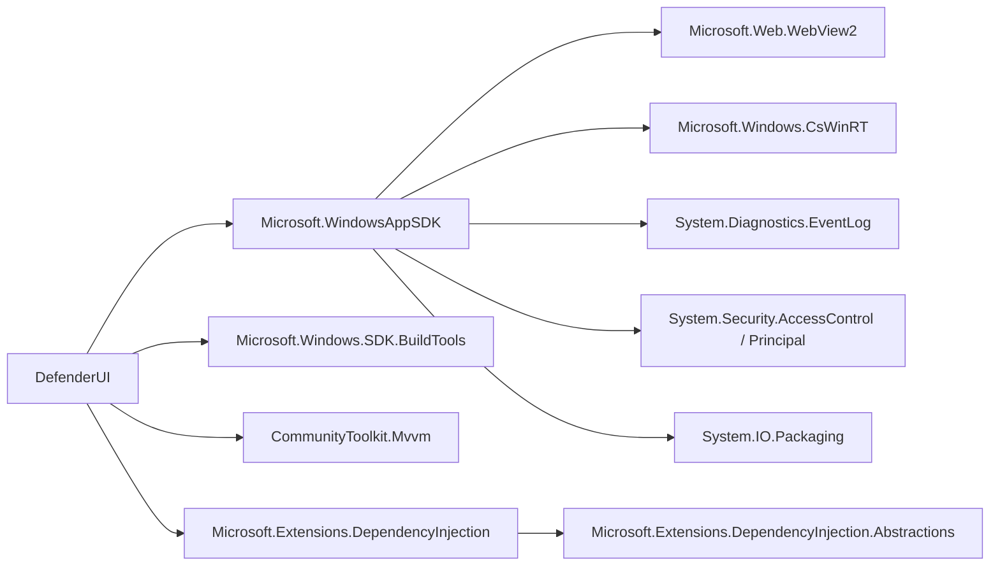

# DefenderUI Dependency Audit

> Tarih: 2026-04-19
> Proje: DefenderUI (WinUI 3, WindowsAppSDK 1.8, `net9.0-windows10.0.26100.0`, x64 unpackaged)
> Amaç: Kullanıcının "çok fazla dependency var, azaltma şansımız var mı?" sorusuna objektif cevap.

---

## TL;DR

**Kısa cevap: Hayır, top-level bağımlılıklar zaten minimum düzeyde — azaltma şansı çok sınırlı.**

Projede **yalnızca 4 doğrudan NuGet paketi** var ve bunların **3'ü zorunlu veya yoğun şekilde kullanılıyor**. Görünen "çok fazla paket" hissi büyük olasılıkla **transitive (bağımlılıkların bağımlılıkları)** ağacından kaynaklanıyor; bu ağaç esas olarak [`Microsoft.WindowsAppSDK`](DefenderUI.csproj:61) ve [`Microsoft.Extensions.DependencyInjection`](DefenderUI.csproj:63) tarafından çekiliyor ve **top-level'da temizleyerek küçültülemez**.

Tek gerçek "opsiyonel" paket [`Microsoft.Extensions.DependencyInjection`](DefenderUI.csproj:63)'dır; o da manuel bir service locator ile değiştirilebilir ancak **elde edilecek kazanç (birkaç KB + ~5-8 transitive paket) refactor maliyetini karşılamaz** (~18 kayıt noktası + 16 `GetRequiredService` call-site).

---

## Mevcut Durum

- **Top-level NuGet paketi sayısı:** 4
- **Hedef framework:** `net9.0-windows10.0.26100.0`
- **Paketleme modu:** Unpackaged (`<WindowsPackageType>None</WindowsPackageType>`)
- **Publish profili:** `PublishReadyToRun=true`, `PublishTrimmed=true` (Release)

### Tüm Doğrudan Paketler

| # | Paket | Versiyon | Öneri |
|---|-------|----------|-------|
| 1 | `Microsoft.Windows.SDK.BuildTools` | `*` | **Tut** (zorunlu build-time) |
| 2 | `Microsoft.WindowsAppSDK` | `*` (1.8.x) | **Tut** (platform zorunluluğu) |
| 3 | `CommunityToolkit.Mvvm` | `8.*` | **Tut** (yoğun kullanım) |
| 4 | `Microsoft.Extensions.DependencyInjection` | `9.*` | **Tut** (orta-yoğun kullanım, pragmatik) |

---

## Doğrudan Paketler — Detaylı Değerlendirme

### 1. `Microsoft.Windows.SDK.BuildTools` `*`

- **Kullanım yoğunluğu:** Build-time only (runtime'da yok)
- **Kullanım kanıtı:** [`DefenderUI.csproj`](DefenderUI.csproj:60) — WinUI 3 projelerinin CsWinRT projection ve WinRT metadata derlemesi için **Windows App SDK'nın peer dependency'si**.
- **Gerçek ihtiyaç:** **Zorunlu.** Windows App SDK ile gelen `Microsoft.WindowsAppSDK` tek başına yeterli değildir; SDK BuildTools olmadan `cswinrt` proje üretimi çalışmaz.
- **Alternatif:** Yok.
- **Öneri:** **Tut**. Versiyonu pinlemek istenirse (`*` yerine) reproducible build açısından iyileştirme olur ama boyut etkisi sıfır (paket runtime'a kopyalanmaz).
- **Kaldırma maliyeti:** — (kaldırılamaz)

---

### 2. `Microsoft.WindowsAppSDK` `*` (1.8.x)

- **Kullanım yoğunluğu:** **Çok yoğun.** Tüm XAML, `Microsoft.UI.Xaml.*` namespace'leri, `Microsoft.UI.Dispatching`, bootstrapper — projenin tüm UI katmanı buna dayanıyor.
- **Kullanım kanıtı:** [`App.xaml.cs`](App.xaml.cs:4) (`using Microsoft.UI.Xaml;`), tüm [`Views/*.xaml.cs`](Views:1) ve [`Controls/*.xaml.cs`](Controls:1) dosyaları.
- **Gerçek ihtiyaç:** **Mutlak zorunlu.** WinUI 3 desktop app bu paket olmadan derlenmez; proje türünün temel taşı.
- **Alternatif:** Yok (WPF'e göç etmek istenmedikçe — bu "dependency azaltma" değil, ürün değişikliği olur).
- **Öneri:** **Tut**. Transitive ağacı şişkin görünse de bu paketin getirdiği tüm alt paketler (CsWinRT, WebView2, System.Diagnostics.*, vb.) **runtime zorunluluğu**dur.
- **Kaldırma maliyeti:** — (kaldırılamaz)

---

### 3. `CommunityToolkit.Mvvm` `8.*`

- **Kullanım yoğunluğu:** **Yoğun.** 12 ViewModel + 3 Model sınıfı toolkit'in `[ObservableProperty]` / `[RelayCommand]` / `ObservableObject` pattern'ine dayanıyor.
- **Kullanım kanıtı:**
  - `[ObservableProperty]` ve `[RelayCommand]` — projede **100+ bildirim**. Örn: [`ViewModels/DashboardViewModel.cs`](ViewModels/DashboardViewModel.cs:19), [`ViewModels/ScanViewModel.cs`](ViewModels/ScanViewModel.cs:41), [`ViewModels/SettingsViewModel.cs`](ViewModels/SettingsViewModel.cs:24), [`ViewModels/ProtectionViewModel.cs`](ViewModels/ProtectionViewModel.cs:11)
  - `ObservableObject` base class — [`Models/ProtectionModule.cs`](Models/ProtectionModule.cs:5), [`Models/ThreatInfo.cs`](Models/ThreatInfo.cs:11), [`ViewModels/FirewallViewModel.cs`](ViewModels/FirewallViewModel.cs:15), ve diğer tüm VM'ler.
  - MVVM Messaging (`IMessenger`, `WeakReferenceMessenger`) — **kullanılmıyor** (navigation/toast için `INavigationService` / `IToastService` elle yazılmış).
- **Gerçek ihtiyaç:** **Evet — yüksek değer/maliyet oranı.**
  - Toolkit olmadan her `[ObservableProperty]` için manuel `INotifyPropertyChanged` backing field + setter yazılmalı (~5-7 satır / property). Mevcut ~80+ property sayıldığında bu **~500-700 LOC ekler**.
  - Her `[RelayCommand]` için manuel `ICommand` implementasyonu (~10 satır + `CanExecute`) → ~30 komut × 10 satır = ~300 LOC.
  - Toplam: **~800-1000 satır sırf boilerplate** → bakım maliyeti ↑, okunabilirlik ↓.
- **Alternatif:** Manuel `INotifyPropertyChanged` + özel `RelayCommand` helper sınıfı.
- **Öneri:** **Kesinlikle tut.** Paket tek başına ~200 KB, build-time source generator olduğu için **runtime çekilen assembly boyutu zaten minimal** (trimming ile daha da düşer). Kaldırmanın getirisi sıfıra yakın, götürüsü büyük.
- **Kaldırma maliyeti:** **Yüksek** (~1 gün refactor + regresyon riski).

> 💡 **Not:** [`DefenderUI.csproj`](DefenderUI.csproj:23)'da `MVVMTK0045` uyarısı bastırılıyor (partial property migration). AOT hedefi olmadığı için şu an sorun yok; ileride AOT yapılırsa migration gerekir ama paket kaldırma ile ilgisi yok.

---

### 4. `Microsoft.Extensions.DependencyInjection` `9.*`

- **Kullanım yoğunluğu:** **Orta-yoğun.**
- **Kullanım kanıtı:**
  - Kayıt: [`App.xaml.cs`](App.xaml.cs:100-135) — 5 service + 12 ViewModel + 5 Page, toplam **22 `Add*` çağrısı**.
  - Çözüm: 16 `GetRequiredService<T>()` call-site — tüm [`Views/*.xaml.cs`](Views:1) (14 page), [`MainWindow.xaml.cs`](MainWindow.xaml.cs:34-35), [`Controls/ToastHost.xaml.cs`](Controls/ToastHost.xaml.cs:56).
- **Gerçek ihtiyaç:** **Opsiyonel — tek gerçek "kaldırılabilir" paket bu.**
- **Alternatif:** Elle yazılmış basit service locator (~40-60 satır). Örnek:
  ```csharp
  public static class ServiceLocator
  {
      private static readonly Dictionary<Type, object> _singletons = new();
      private static readonly Dictionary<Type, Func<object>> _factories = new();
      public static void RegisterSingleton<T>(T instance) where T : class
          => _singletons[typeof(T)] = instance;
      public static void RegisterTransient<T>(Func<T> factory) where T : class
          => _factories[typeof(T)] = () => factory();
      public static T GetRequired<T>() where T : class
          => (T)(_singletons.TryGetValue(typeof(T), out var s) ? s : _factories[typeof(T)]());
  }
  ```
- **Kazanç:**
  - `Microsoft.Extensions.DependencyInjection` + `Microsoft.Extensions.DependencyInjection.Abstractions` + `Microsoft.Extensions.Logging.Abstractions` + `Microsoft.Extensions.Options` vb. transitive zincir → **~4-6 paket silinir**, **~300-500 KB binary** (trimmed daha az).
  - Runtime'da kod yolu daha kısa (yansıma yok).
- **Kayıp:**
  - 18 kayıt satırı + 16 call-site **tek tek refactor edilir**.
  - Constructor injection kaybı (MVVM toolkit ile birleşince şu an da sık kullanılmıyor — `App.Current.Services.GetRequiredService<T>()` pattern'i zaten service locator'a benziyor).
  - Scope/Dispose yönetimi manuel — ama `ScanViewModel`'ın singleton ömrü zaten manuel yönetiliyor ([`App.xaml.cs`](App.xaml.cs:113-116) yorumuna bakın).
  - DI "best practice" kaybı; ileride karmaşıklık artarsa geri almak maliyetli.
- **Öneri:** **Tut (pragmatik olarak)**. Kaldırmak mümkün ama:
  - Kazanç: birkaç paket + ~birkaç yüz KB (Release trimmed'de daha az).
  - Risk: regresyon, 34 call-site dokunulur.
  - Değer/maliyet oranı **negatif** — "sadece paket sayısını azaltmak için" yapılmamalı.
- **Kaldırma maliyeti:** **Orta** (~4-6 saat refactor + test).

---

## Kullanılmayan / Gereksiz Paket Var mı?

**Hayır.** [`DefenderUI.csproj`](DefenderUI.csproj:59-64)'da:

- `Microsoft.Xaml.Behaviors.WinUI.Managed` → **YOK** (sadece WPF'te kullanılıyordu; WinUI 3'te olmadığı iyi).
- `Microsoft.Extensions.Logging`, `Options`, `Configuration`, `Hosting` → **YOK** (DI'ın kardeş paketleri çekilmemiş, iyi).
- `System.Text.Json`, `Newtonsoft.Json` → **YOK** (serialization kodu yok).
- `Serilog`, `NLog` → **YOK** ([`App.xaml.cs`](App.xaml.cs:52) el yapımı `LogCrash` var, `File.AppendAllText` kullanıyor).
- `Microsoft.UI.Xaml` (bağımsız WinUI 2 paketi) → **YOK** (iyi, WindowsAppSDK zaten WinUI 3 içeriyor).

Zaten yalın, net bir dependency listesi var.

---

## Transitive Bağımlılıklar Hakkında

Görsel "çokluk" muhtemelen buradan geliyor. `dotnet list package --include-transitive` çalıştırılırsa yaklaşık şu ağaç görülür:



- **Kırmızı alan yok.** Tüm transitive'ler zorunlu SDK bileşenleri.
- `WindowsAppSDK`'nın getirdikleri (WebView2, CsWinRT, event log, vb.) **silinemez** — `<WindowsAppSDK>` öyle paketlenmiş.
- **Tek manipüle edilebilir** olan `Microsoft.Extensions.DependencyInjection` zinciri (1-2 alt paket).

> Transitive paket sayısını azaltmanın tek yolu: **top-level kaldırmak**. Ama yukarıda görüldüğü gibi tek aday `Microsoft.Extensions.DependencyInjection` — ve önerilen "tut".

---

## Konsolidasyon Fırsatları

**Yok.** Konsolide edilecek çakışan paket kümesi mevcut değil:

- ✅ Tek MVVM framework (`CommunityToolkit.Mvvm`) — `Prism`, `MVVM Light`, `ReactiveUI` gibi paraleli yok.
- ✅ Tek DI container (`Microsoft.Extensions.DependencyInjection`) — `Autofac`, `Unity` gibi paraleli yok.
- ✅ Tek UI framework (`Microsoft.WindowsAppSDK`) — `Microsoft.UI.Xaml` (WinUI 2) yok.
- ✅ Tek JSON/serializer yok — çünkü gerek de yok (şu an mock data, file persistence yok).

---

## Tavsiye Edilen Eylem Planı (Öncelik Sırasına Göre)

### 🟢 Öncelik 1 — Kolay & Zorunlu (1 saat)

1. **Versiyonları pinle**: `Version="*"` yerine somut versiyon kullan. Reproducible build açısından kritik, paket sayısını değiştirmez ama "dependency hygiene" iyileştirir.
   ```xml
   <PackageReference Include="Microsoft.WindowsAppSDK" Version="1.8.250515001" />
   <PackageReference Include="CommunityToolkit.Mvvm" Version="8.4.0" />
   <PackageReference Include="Microsoft.Extensions.DependencyInjection" Version="9.0.11" />
   ```

2. **`PublishTrimmed=true` zaten açık** — Release build'de kullanılmayan kod zaten budanıyor. Ek aksiyon gerekmiyor.

### 🟡 Öncelik 2 — Opsiyonel & Orta Kazanç (4-6 saat)

3. **(Tartışmalı)** `Microsoft.Extensions.DependencyInjection`'ı basit service locator ile değiştir.
   - **Sadece** "paket sayısı bağımlılığı katı biçimde düşürülmek isteniyorsa" düşünülebilir.
   - Aksi halde değmez — mevcut kod temiz ve test edilebilir.

### 🔴 Öncelik 3 — Önerilmeyen (büyük refactor)

4. ~~`CommunityToolkit.Mvvm`'i kaldırmak~~ → **Önerilmez.** ~800-1000 LOC boilerplate ekler, bakım maliyeti fırlar.
5. ~~`Microsoft.WindowsAppSDK` alternatifi~~ → Ürün değişikliği; dependency azaltma kapsamında değil.

---

## Risk / Fayda Değerlendirmesi

| Metrik | Mevcut | Hedef (her şey yapılırsa) | Kazanç |
|--------|--------|---------------------------|--------|
| Top-level paket sayısı | 4 | 3 (DI çıkarılırsa) | **-1** |
| Transitive paket sayısı (tahmini) | ~35-45 | ~32-42 | **-2 ile -5 arası** |
| Release binary boyutu (trimmed, x64, tahmini) | ~35-45 MB | ~34-44 MB | **%1-3** |
| Refactor saati | 0 | 4-6 saat (DI) + 1 gün (MVVM — önerilmez) | Değişken |
| Regresyon riski | 0 | **Orta** (DI için 34 call-site) | — |

### Objektif Sonuç

- **Proje zaten temiz.** Benzer ölçekte WinUI 3 projelerine kıyasla minimum bağımlılık kullanılıyor.
- **"Çok fazla dependency" algısı** büyük ihtimalle:
  - Solution Explorer'da transitive ağaç gösterimi (VS'da ~40 paket görünür ama 4'ü top-level).
  - `bin/` klasöründeki DLL sayısı (~60-80 DLL — çoğu .NET runtime + WinAppSDK CsWinRT projection assembly'leri, NuGet ile ilgisi sınırlı).
- **Yapılacak tek meşru eylem:** versiyonları pinle. Diğer değişiklikler ROI negatif.

---

## Özet Karar Tablosu

| Paket | Karar | Gerekçe (tek cümle) |
|-------|-------|---------------------|
| [`Microsoft.Windows.SDK.BuildTools`](DefenderUI.csproj:60) | ✅ **Tut** | WinUI 3 build zorunluluğu |
| [`Microsoft.WindowsAppSDK`](DefenderUI.csproj:61) | ✅ **Tut** | Tüm UI katmanı buna dayanıyor |
| [`CommunityToolkit.Mvvm`](DefenderUI.csproj:62) | ✅ **Tut** | 100+ kullanım noktası, alternatifi ~900 LOC ekler |
| [`Microsoft.Extensions.DependencyInjection`](DefenderUI.csproj:63) | ✅ **Tut** (pragmatik) | Opsiyonel ama kaldırma maliyeti kazançtan büyük |

**Sonuç: "Azaltma şansı" sorusuna objektif cevap → _Uygulanabilir önemli bir azaltma yok; proje zaten yalın._**