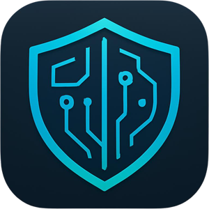

<div align="center">
  

  # 🛡️ DefenderUI

  **A premium, modern Windows antivirus UI concept built with WinUI 3**

  [](https://github.com/caymazyusuf72/defenderui/actions/workflows/ci.yml)
  [](https://github.com/caymazyusuf72/defenderui/actions/workflows/codeql.yml)
  [](LICENSE)
  [](https://github.com/caymazyusuf72/defenderui/stargazers)
  [](https://www.microsoft.com/windows)
  [](https://dotnet.microsoft.com/)
  [](https://learn.microsoft.com/windows/apps/winui/winui3/)
  [](CONTRIBUTING.md)

  [Features](#-features) · [Screenshots](#-screenshots) · [Getting Started](#-getting-started) · [Tech Stack](#%EF%B8%8F-tech-stack) · [Contributing](#-contributing)
</div>

---

## ⚠️ Important Notice

> **DefenderUI is a frontend-only UI/UX concept.** It does **NOT** include any real antivirus engine, threat detection, or file scanning logic. **All data displayed is mocked** for demonstration purposes only.
>
> This project is intended as a **design showcase** and a **reference implementation** for building modern, premium-feeling Windows 11 applications with WinUI 3. It is not a security product and should not be used for actual threat protection.

---

## ✨ Features

- 🎨 **Premium Dark Theme** with Mica backdrop — native Windows 11 look & feel
- 🛡️ **7 fully-featured pages** — Dashboard, Scan, Protection, Quarantine, Reports, Update, Settings
- ⚡ **Rich animation system** powered by the Windows Composition API — GPU-accelerated, 60 fps
- 🎯 **Real-time scan simulation** with progress shimmer and scan-line effects
- 🔥 **Glow pulse, ripple effects, and staggered entrance animations** for a living, breathing interface
- 📊 **Animated progress bars** with odometer-style number count-up
- 🎛️ **Full MVVM architecture** with [CommunityToolkit.Mvvm](https://github.com/CommunityToolkit/dotnet)
- 🌐 **Dependency Injection** via `Microsoft.Extensions.DependencyInjection`
- 💎 **Premium Fluent Design** — rounded corners, soft shadows, elevation cards
- ♿ **Accessibility-first** — `AutomationProperties` on all interactive controls
- 🖱️ **Button micro-interactions** — hover, press, and spring-back release animations
- 🌊 **Card hover lift effects** with smooth translation & shadow transitions
- 📱 **Responsive layout** that adapts to different window sizes

---

## 📸 Screenshots

> **Note:** Screenshots are placeholders. Run the app locally to see all animations in action. See [`.github/screenshots/README.md`](.github/screenshots/README.md) for contribution guidance.

| Dashboard | Scan | Protection |
|:---:|:---:|:---:|
| _Hero status card + KPIs_ | _Simulated real-time scanning_ | _6 protection modules_ |

| Quarantine | Reports | Settings |
|:---:|:---:|:---:|
| _Card-based threat list_ | _Animated charts_ | _8 settings categories_ |

---

## 🚀 Getting Started

### Prerequisites

- **Windows 11** (or Windows 10 build 19041+)
- **.NET 9 SDK** — [Download](https://dotnet.microsoft.com/download/dotnet/9.0)
- **Developer Mode** enabled — `Settings → System → For developers`
- **Visual Studio 2022** with the **Windows App SDK C# Templates** workload (recommended), or **VS Code** with the C# Dev Kit extension

### Clone & Build

```powershell
# Clone the repository
git clone https://github.com/caymazyusuf72/defenderui.git
cd defenderui

# Detect your CPU architecture (x64 / ARM64 / x86)
$Platform = $env:PROCESSOR_ARCHITECTURE

# Restore and build
dotnet restore
dotnet build -c Debug -p:Platform=$Platform
```

### Run the App

The project is configured as an **unpackaged** WinUI 3 app (`WindowsPackageType=None`), so you can launch the built executable directly:

```powershell
# Run from the build output
$Rid = $Platform.ToLower()
.\bin\$Platform\Debug\net9.0-windows10.0.26100.0\win-$Rid\DefenderUI.exe
```

Or simply:

```powershell
dotnet run -c Debug -p:Platform=$Platform
```

### 📦 Single-file self-contained build (.NET kurulu olmayan makineler için)

Kullanıcıların **.NET Runtime kurmadan** çalıştırabileceği **tek bir `.exe` dosyası** üretmek için hazır publish profilleri mevcuttur ([`Properties/PublishProfiles/`](Properties/PublishProfiles/)):

```powershell
# Örn. x64 için tek exe üretimi
dotnet publish -c Release -p:Platform=x64 -p:PublishProfile=win-x64

# Üretilen tek dosyalık exe
.\bin\x64\Release\net9.0-windows10.0.26100.0\win-x64\publish\DefenderUI.exe
```

Çıktı dizinindeki **`DefenderUI.exe`** kendi başına, dış bağımlılıksız çalışır (~150-200 MB, sıkıştırılmış). Aynı komut `x86` ve `ARM64` için de kullanılabilir (`-p:Platform=x86 -p:PublishProfile=win-x86` veya `-p:Platform=ARM64 -p:PublishProfile=win-arm64`).

> **İpucu:** Yeni bir `v*.*.*` tag'i push ettiğinizde [`release.yml`](.github/workflows/release.yml) workflow'u her mimari için hem tek dosyalık `DefenderUI-<arch>.exe` hem de `DefenderUI-<arch>.zip` arşivini otomatik olarak GitHub Releases'e yükler.

---

## 🏗️ Tech Stack

| Layer | Technology |
|---|---|
| **UI Framework** | [WinUI 3](https://learn.microsoft.com/windows/apps/winui/winui3/) (Windows App SDK) |
| **Runtime** | .NET 9 (`net9.0-windows10.0.26100.0`) |
| **Language** | C# 13 |
| **MVVM Toolkit** | [`CommunityToolkit.Mvvm`](https://www.nuget.org/packages/CommunityToolkit.Mvvm) 8.x |
| **Controls** | [`CommunityToolkit.WinUI.UI.Controls`](https://www.nuget.org/packages/CommunityToolkit.WinUI.UI.Controls) 7.x |
| **Behaviors** | `Microsoft.Xaml.Behaviors.WinUI.Managed` 2.x |
| **Dependency Injection** | `Microsoft.Extensions.DependencyInjection` 9.x |
| **Animations** | [Windows.UI.Composition API](https://learn.microsoft.com/windows/apps/design/motion/composition-animations) |
| **Packaging** | Unpackaged (`WindowsPackageType=None`) |
| **Supported Architectures** | `x86`, `x64`, `ARM64` |

---

## 📂 Project Structure

```
DefenderUI/
├── Assets/          # App icons, logos, splash
├── Controls/        # Custom controls (reserved)
├── Helpers/         # AnimationHelper, CardHoverEffect, ButtonEffects, RippleEffect, converters
├── Models/          # Data models (ThreatInfo, ScanResult, QuarantineItem, ...)
├── Services/        # MockDataService (sample data provider)
├── Styles/          # Colors, Typography, CardStyles, ButtonStyles, Animations
├── ViewModels/      # MVVM view-models (one per page)
├── Views/           # XAML pages (Dashboard, Scan, Protection, Quarantine, Reports, Update, Settings)
├── App.xaml(.cs)    # Application entry point + DI container
├── MainWindow.xaml  # Shell window with NavigationView
└── DefenderUI.csproj
```

See [`ARCHITECTURE.md`](ARCHITECTURE.md) for a detailed breakdown of every page, view-model, service, and design token.

---

## 🎬 Animation Showcase

DefenderUI treats motion as a first-class citizen. Every interaction is reinforced with a purposeful, GPU-accelerated animation:

| Effect | Where | Description |
|---|---|---|
| **Staggered entrance** | All pages | Cards fade + slide in with cascading delays on navigation |
| **Card hover lift** | All cards | Translate `Y: -4px` + shadow elevation on pointer enter |
| **Button spring-back** | All buttons | Scale `0.96 → 1.0` with back easing on press/release |
| **Ripple** | Primary buttons | Expanding circle from pointer position on click |
| **Glow pulse** | Hero status card | Continuous soft-glow breathing effect |
| **Progress shimmer** | Scan / Update pages | Moving highlight across progress bars |
| **Scan-line** | Scan page | Vertical scanning beam across the progress ring |
| **Odometer count-up** | KPI cards | Numbers animate from 0 to target on load |
| **Smooth page transition** | NavigationView | Fade + slide-from-right between pages |

All animations are implemented via the Composition API in [`Helpers/AnimationHelper.cs`](Helpers/AnimationHelper.cs) and related helper classes, keeping XAML clean and performance high.

---

## 🤝 Contributing

Contributions are warmly welcomed! Whether it's a bug report, a new animation idea, a UI polish, or full-blown feature work — please read our [**Contributing Guide**](CONTRIBUTING.md) and [**Code of Conduct**](CODE_OF_CONDUCT.md) first.

**Quick links:**
- 🐛 [Report a bug](https://github.com/caymazyusuf72/defenderui/issues/new?template=bug_report.yml)
- 💡 [Request a feature](https://github.com/caymazyusuf72/defenderui/issues/new?template=feature_request.yml)
- 🛡️ [Report a security issue](SECURITY.md)

---

## 📝 License

This project is licensed under the **MIT License** — see the [`LICENSE`](LICENSE) file for details.

```
MIT License
Copyright (c) 2026 DefenderUI Contributors
```

---

## 🙏 Acknowledgments

- The **WinUI 3 team at Microsoft** for an excellent modern UI framework
- The **[.NET Community Toolkit](https://github.com/CommunityToolkit/dotnet)** contributors for MVVM, converters, and controls
- Design inspiration drawn from **Kaspersky**, **Bitdefender**, **Norton**, and **Windows Security**
- The broader **WinUI / WinAppSDK community** for samples, docs, and feedback

---

<div align="center">

  Made with ❤️ for Windows 11 using WinUI 3

  ⭐ If you find this project useful, please consider giving it a star!

</div>