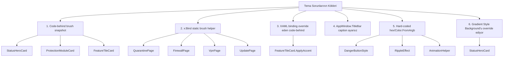

# DefenderUI Tema/Renk Audit Raporu

> **Tarih:** 2026-04-19
> **Kapsam:** Tüm `Styles/*.xaml`, `Controls/*.xaml[.cs]`, `Views/*.xaml[.cs]`, `Helpers/*.cs`, `Services/ThemeService.cs`, [`App.xaml`](App.xaml:1), [`MainWindow.xaml`](MainWindow.xaml:1)
> **İncelenen dosya sayısı:** 47 (8 Styles, 18 Controls dosyası, 22 Views dosyası, 6 Helpers, 1 Service, App/MainWindow)

---

## Özet

- **Toplam bulgu sayısı:** 24
- **Kritik:** 6
- **Yüksek:** 6
- **Orta:** 7
- **Düşük:** 5

### En kritik sorunun özeti

Projede tema değişimine **kısmen yanıt veren** bir mimari var. [`Styles/Colors.xaml`](Styles/Colors.xaml:19) içinde Light/Dark/HighContrast `ThemeDictionaries` doğru tanımlanmış; ancak ~10 farklı yerde (code-behind'da `Application.Current.Resources.TryGetValue` ile çekilen brush'lar + XAML `{ThemeResource}` binding'lerini override eden direct property atamaları + `x:Bind` static helper metodları) tema **snapshot**'a yakalanıyor. Kullanıcı Light→Dark geçtiğinde bu snapshot'lar **güncellenmiyor**; dolayısıyla hero kartları, risk/ping rozetleri, title bar caption butonları ve bazı ikonlar **eski temada kalıyor**.

### Sorun kategorilerinin haritası



---

## Bulgular

> Her bulgu, şiddete ve ardından etki yüzeyine göre sıralanmıştır. Bulgu numaraları düzeltme fazında referans için sabit kalacaktır.

---

### [1] StatusHeroCard `ActualThemeChanged`'a abone değil — hero kart tema değişiminde bozuk kalır — Şiddet: **Kritik**

**Dosya:** [`Controls/StatusHeroCard.xaml.cs`](Controls/StatusHeroCard.xaml.cs:130)
**Sorun:**
Control constructor'ında yalnızca [`MotionPreferences.Changed`](Controls/StatusHeroCard.xaml.cs:147) event'ine abone olunuyor. Tema değişince [`ApplySeverity()`](Controls/StatusHeroCard.xaml.cs:226) yeniden çağrılmıyor. Bu metot içinde [`Application.Current.Resources.TryGetValue`](Controls/StatusHeroCard.xaml.cs:292) ile çekilen `fgKey` (`StatusRiskBrush` vb.) ve `softKey` (`StatusRiskSoftBrush` vb.) brush'ları snapshot olarak `HeroIcon.Foreground` ve `IconHalo.Fill` özelliklerine **local-set** ediliyor; bu local atama XAML'deki `{ThemeResource}` binding'ini kalıcı olarak kırar.

Ek olarak [`GradientStop1.Color`](Controls/StatusHeroCard.xaml.cs:280) ve `GradientStop2.Color` de `accentColor` sabit değerinden hesaplanıyor; tema değişse de hesaplanan değer aynı (Severity'e bağlı) fakat kartın görsel ilişkisi (yüzey rengine fade) Dark'ta farklı olmalıdır.

Not: [`Controls/ScanModeCard.xaml.cs:140`](Controls/ScanModeCard.xaml.cs:140), [`Controls/ActivityListItem.xaml.cs:91`](Controls/ActivityListItem.xaml.cs:91), [`Controls/StatCard.xaml.cs:105`](Controls/StatCard.xaml.cs:105), [`Controls/StatusPill.xaml.cs:50`](Controls/StatusPill.xaml.cs:50) gibi önceki iterasyonda düzeltilen kontroller bu pattern'i doğru uyguluyor. **StatusHeroCard unutulmuş**.

**Önerilen düzeltme:**
```csharp
public StatusHeroCard()
{
    InitializeComponent();
    Loaded += (_, _) => { /* mevcut kod */ };
    Unloaded += (_, _) => { /* mevcut kod */ };
    MotionPreferences.Changed += OnMotionPreferencesChanged;
    // EKLE:
    ActualThemeChanged += (_, _) => ApplySeverity();
}
```

---

### [2] ProtectionModuleCard `ActualThemeChanged`'a abone değil — status dot + "Aktif/Kapalı" yazısı tema değişince eski renge saplanır — Şiddet: **Kritik**

**Dosya:** [`Controls/ProtectionModuleCard.xaml.cs`](Controls/ProtectionModuleCard.xaml.cs:179)
**Sorun:**
Constructor yalnızca `Loaded` event'ine abone. [`ApplyStatus()`](Controls/ProtectionModuleCard.xaml.cs:192) metodu `Application.Current.Resources.TryGetValue` üzerinden `StatusProtectedBrush`/`StatusWarningBrush`/`TextTertiaryBrush` brush'larını çekip `StatusDot.Fill` ve `StatusLabel.Foreground`'a **local-set** ediyor. Kart tema değişince yeniden boyanmıyor; Dark temaya geçildiğinde Light'taki #107C10 brush referansı HÂLÂ kullanılıyor (ve bu brush instance'ı Light dictionary'sine ait olduğu için rengi Light sabit kalır).

Bu card dashboard modül özetinde + [`Views/ProtectionPage.xaml:78`](Views/ProtectionPage.xaml:78) + [`Views/PrivacyPage.xaml:55`](Views/PrivacyPage.xaml:55) + [`Views/ProtectionPage.xaml:113`](Views/ProtectionPage.xaml:113)'te kullanılıyor; etki yüzeyi geniş.

**Önerilen düzeltme:**
```csharp
public ProtectionModuleCard()
{
    InitializeComponent();
    Loaded += (_, _) => { /* mevcut */ };
    ActualThemeChanged += (_, _) => ApplyStatus();
}
```

---

### [3] FeatureTileCard `ActualThemeChanged`'a abone değil + XAML ThemeResource binding'ini code-behind koşulsuz kırıyor — Şiddet: **Kritik**

**Dosya:** [`Controls/FeatureTileCard.xaml.cs`](Controls/FeatureTileCard.xaml.cs:205)
**Sorun:**
İki bağımsız kusur var:

1. **`ActualThemeChanged` yok**: Constructor'da yalnızca `Loaded` handler var. Tema değişince `ApplyAccent()` yeniden çağrılmıyor.

2. **XAML binding'i koşulsuz kırılıyor**: [`FeatureTileCard.xaml:65`](Controls/FeatureTileCard.xaml:65)'te `IconGlyph.Foreground="{ThemeResource AccentPrimaryBrush}"` ve `ActionTextLabel.Foreground="{ThemeResource AccentPrimaryBrush}"` zaten doğru bağlanmış. Ancak [`ApplyAccent()`](Controls/FeatureTileCard.xaml.cs:205) kullanıcı `AccentBrush` DP'sini **set etmemiş olsa bile** fallback olarak `Application.Current.Resources["AccentPrimaryBrush"]` snapshot'ını alıp `IconGlyph.Foreground = brush` ve `ActionTextLabel.Foreground = brush` ile **local-set** ediyor (satır 222-225). Bu atama XAML'deki `{ThemeResource}` binding'ini kalıcı olarak geçersiz kılar.

Sonuç: Dashboard'da ve ToolsPage'teki 8+ FeatureTileCard kullanımında ikon rengi Light temanın accent'ında donar.

**Önerilen düzeltme:**
- Sadece `AccentBrush` DP açıkça set edilmişse `ApplyAccent`'i devreye sok; aksi halde XAML'deki ThemeResource binding'ine dokunma.
- `ActualThemeChanged += (_, _) => ApplyAccent();` ekle.
```csharp
private void ApplyAccent()
{
    if (IconGlyph is null || ActionTextLabel is null) return;

    // DP açıkça set edildiyse override uygula.
    if (AccentBrush is not null)
    {
        IconGlyph.Foreground = AccentBrush;
        ActionTextLabel.Foreground = AccentBrush;
    }
    else
    {
        // XAML ThemeResource binding'ini geri yükle.
        IconGlyph.ClearValue(TextElement.ForegroundProperty);
        ActionTextLabel.ClearValue(TextElement.ForegroundProperty);
    }
}
```
> Not: `TextElement.ForegroundProperty` yerine `FontIcon.ForegroundProperty` / `TextBlock.ForegroundProperty` de kullanılabilir; XAML'deki orijinal binding'in hangi DependencyProperty üzerinden yapıldığını doğrula.

---

### [4] x:Bind statik brush helper'ları tema değişiminde yeniden çalışmıyor — QuarantinePage, FirewallPage, VpnPage, UpdatePage — Şiddet: **Kritik**

**Dosyalar:**
- [`Views/QuarantinePage.xaml.cs:49`](Views/QuarantinePage.xaml.cs:49) → `GetRiskBrush`, `GetRiskSoftBrush`
- [`Views/FirewallPage.xaml.cs:26`](Views/FirewallPage.xaml.cs:26) → `GetActionBrush`, `GetActionForeground`
- [`Views/VpnPage.xaml.cs:37`](Views/VpnPage.xaml.cs:37) → `GetConnectBackground`, `GetPingBackground`, `GetPingForeground`
- [`Views/UpdatePage.xaml.cs:71`](Views/UpdatePage.xaml.cs:71) → `GetStatusBrush`

**Sorun:**
XAML'de [`Views/QuarantinePage.xaml:225`](Views/QuarantinePage.xaml:225), [`Views/FirewallPage.xaml:212`](Views/FirewallPage.xaml:212), [`Views/VpnPage.xaml:182`](Views/VpnPage.xaml:182) vb. satırlarda şu pattern yaygın:

```xml
<Border Background="{x:Bind local:QuarantinePage.GetRiskSoftBrush(RiskLevel), Mode=OneWay}" ...>
```

`x:Bind Mode=OneWay` **yalnızca bind edilen kaynak property (`RiskLevel`) değiştiğinde** yeniden değerlendirilir. Tema değiştiğinde `RiskLevel` aynı kalır, yani helper tekrar çağrılmaz. Helper ise `Application.Current.Resources.TryGetValue` ile brush'ı bir kez çekip `Brush` instance'ı döndürüyor — ve bu instance Light tema dictionary'sinden gelmişse, Dark'a geçince hâlâ Light brush'ını gösterir.

**Etki alanları:**
- **QuarantinePage**: Tüm karantina satırlarında risk badge (arkaplan + yazı) + threat ikonu rengi tema değişince eski kalır.
- **FirewallPage**: Tüm uygulama kurallarının "İzin/Engelle" rozet arka planı + yazı rengi eski kalır.
- **VpnPage**: Sunucu listesindeki ping kalite rozetleri + büyük "Bağlan" butonunun arka planı eski kalır.
- **UpdatePage**: Güncelleme geçmişi tablosunda her satırın "Başarılı/Başarısız" ikonu + yazı rengi eski kalır.

**Önerilen düzeltme:**
Bu döner-değer helper'lar **yerine**, XAML tarafında `{ThemeResource}` kullanıp bool/enum → brush eşlemesini:

**Seçenek A (önerilen):** Custom `IValueConverter` yaz (ör. `RiskLevelToBrushConverter`). Converter her tema değişiminde dolaylı olarak yeniden tetiklenmez ama **ListView'in kendisi `ActualThemeChanged` aldığında** içindeki tüm binding'ler `ThemeResource` üzerinden çözülür. Converter `enum` → `string key` döndürmek yerine doğrudan `{ThemeResource Key}` referansı döndüremez; bu nedenle:

**Seçenek B (daha temiz):** XAML tarafında `DataTemplate` içinde `DataTriggerBehavior` veya `VisualStateManager` + `ThemeResource` kombinasyonu kullan. Ya da `ItemTemplate`'i bool/enum'a göre farklı template'lere bölüp (`DataTemplateSelector`) her template'te `{ThemeResource}` sabit anahtarını hard-code et.

**Seçenek C (pragmatik — asgari değişiklik):** Sayfanın `ActualThemeChanged`'a abone ol, event'te `ListView.ItemsSource`'u `null` yapıp geri ata (veya `ListView.ItemTemplateSelector.SelectTemplate` tetikleyen bir Refresh metodu yaz). Bu, tüm x:Bind'ları yeniden evaluate ettirir.

```csharp
// QuarantinePage.xaml.cs (örnek Seçenek C)
public QuarantinePage()
{
    /* ... */
    ActualThemeChanged += (_, _) => RefreshList();
}
private void RefreshList()
{
    var src = QuarantineList.ItemsSource;
    QuarantineList.ItemsSource = null;
    QuarantineList.ItemsSource = src;
}
```

> En sürdürülebilir çözüm **Seçenek A + B karışımı**dır; ancak kritik seviye çözüm için Seçenek C hızlı yamadır.

---

### [5] MainWindow `AppWindow.TitleBar` caption button renkleri tema-aware değil — Şiddet: **Kritik**

**Dosya:** [`MainWindow.xaml.cs:36`](MainWindow.xaml.cs:36)
**Sorun:**
`ExtendsContentIntoTitleBar = true` yapılıyor ve [`SetTitleBar(TitleBarDragRegion)`](MainWindow.xaml.cs:37) çağrılıyor; fakat `AppWindow.TitleBar.ButtonBackgroundColor`, `ButtonForegroundColor`, `ButtonHoverBackgroundColor`, `ButtonInactiveForegroundColor`, `ButtonInactiveBackgroundColor`, `ButtonPressedBackgroundColor`, `ButtonPressedForegroundColor` ayarları **hiç yapılmıyor**.

Windows 11 MicaBackdrop + custom title bar kombinasyonunda sistem caption butonlarının (Min / Max / Close) rengi Windows'un tema tercihine göre (app tema tercihine göre değil) gelir. Kullanıcı uygulama içi "Tema Toggle" ile Light↔Dark yapınca caption butonları **güncellenmez**. Dark temada beyaz ikonlar şeffaf arka plan üzerinde görünür olsa da, MicaBackdrop açık tonlara kaydığında Close butonunun "X" ikonu okunmayacak kadar zayıflar.

**Önerilen düzeltme:**
```csharp
private void UpdateTitleBarColors()
{
    if (AppWindow?.TitleBar is not { } tb) return;
    tb.ButtonBackgroundColor = Microsoft.UI.Colors.Transparent;
    tb.ButtonInactiveBackgroundColor = Microsoft.UI.Colors.Transparent;
    var fg = _themeService.CurrentTheme switch
    {
        ElementTheme.Dark => Microsoft.UI.Colors.White,
        ElementTheme.Light => Microsoft.UI.Colors.Black,
        _ => /* SystemAccentColor veya SystemForegroundColor */ Microsoft.UI.Colors.Black,
    };
    tb.ButtonForegroundColor = fg;
    tb.ButtonHoverForegroundColor = fg;
    tb.ButtonPressedForegroundColor = fg;
    tb.ButtonInactiveForegroundColor = fg;
}
```
Bu metodu `MainWindow()` constructor'ında **ve** `ThemeToggleButton_Click` içinde tema değişiminden sonra çağır.

---

### [6] StatusHeroCard'daki LinearGradientBrush, Style'ın Background setter'ını override ediyor — Dark temada kart yüzeyi kayboluyor — Şiddet: **Kritik**

**Dosya:** [`Controls/StatusHeroCard.xaml:22`](Controls/StatusHeroCard.xaml:22)
**Sorun:**
```xml
<Border x:Name="RootCard" Style="{StaticResource HeroStatusCardStyle}">
    <Border.Background>
        <LinearGradientBrush ...>
            <GradientStop Color="#1A107C10" Offset="0.0" />
            <GradientStop Color="#00107C10" Offset="0.55" />
        </LinearGradientBrush>
    </Border.Background>
```

[`HeroStatusCardStyle`](Styles/CardStyles.xaml:52)'de `Setter Property="Background" Value="{ThemeResource SurfaceElevatedBrush}"` vardı, ancak XAML'de `<Border.Background>` direkt override ediyor. Bu gradient:
- Alpha 0x1A (~%10) — çok hafif renk tonu
- Stop2 alpha 0x00 — tamamen transparent
- Arkada **SurfaceElevatedBrush yok** (override edildi)

Sonuç: Kartın arkaplanı yalnızca bu gradient olur. Light temada `SurfaceBackgroundBrush` (#F3F3F3) üstünde gradient hafifçe görünür ama kart yine de beyaz tonlu algılanır. **Dark temada** [`Views/DashboardPage.xaml:15`](Views/DashboardPage.xaml:15)'in Background'u `#1C1C1C` — gradient renk tonu bu karanlık üstünde yok olur ve kart tamamen kaybolur; "kart" algısı yok, içerik zeminde asılı kalır.

Ayrıca gradient renk tonu code-behind'dan [`ApplySeverity`](Controls/StatusHeroCard.xaml.cs:280)'de yeniden set ediliyor — yani XAML'deki initial değer yalnızca ilk frame geçerli.

**Önerilen düzeltme:**
Border hiyerarşisini iki katmanlı yap:
1. **Dış Border**: `Style="{StaticResource HeroStatusCardStyle}"` (opaque `SurfaceElevatedBrush`).
2. **İç Border** veya **Rectangle**: `CornerRadius` ile eşleşen, `Margin="0"`, `LinearGradientBrush` arkaplanlı dekoratif katman.

```xml
<Border Style="{StaticResource HeroStatusCardStyle}">
    <Grid>
        <!-- Gradient decoration katmanı -->
        <Border CornerRadius="{StaticResource CornerRadiusHero}"
                IsHitTestVisible="False">
            <Border.Background>
                <LinearGradientBrush ...>
                    <GradientStop x:Name="GradientStop1" Color="..." Offset="0.0" />
                    <GradientStop x:Name="GradientStop2" Color="..." Offset="0.55" />
                </LinearGradientBrush>
            </Border.Background>
        </Border>
        <!-- İçerik -->
        <Grid ColumnSpacing="24"> ... </Grid>
    </Grid>
</Border>
```

Bu sayede `SurfaceElevatedBrush` tema-aware arkaplan KORUNUR, gradient dekoratif katman olarak üste biner.

---

### [7] StatusHeroCard XAML'de gradient rengi hard-coded initial değer — Şiddet: **Yüksek**

**Dosya:** [`Controls/StatusHeroCard.xaml:27-28`](Controls/StatusHeroCard.xaml:27)
**Sorun:**
```xml
<GradientStop x:Name="GradientStop1" Color="#1A107C10" Offset="0.0" />
<GradientStop x:Name="GradientStop2" Color="#00107C10" Offset="0.55" />
```

Initial değer "Protected severity" için `#107C10`'a (yeşil) bağlı. Control herhangi bir başka severity ile (ör. `AtRisk`) oluşturulursa, control `Loaded` event'ine kadar 1 frame boyunca yanlış renk (yeşil) gösterilir. `Loaded` event'inde [`ApplySeverity`](Controls/StatusHeroCard.xaml.cs:133) çağrılıyor ve gradient stops güncelleniyor, ama bu flicker kaçınılmaz.

Ayrıca stop2'nin alpha=0x00 olması — target renk bilinmediği için transparent yapmak semantik olarak yanlış. Tasarım amacı accent'ten `SurfaceElevatedBrush`'a fade olmaliydı; bu XAML'de ThemeResource ile yapılamadığı için code-behind'ta manuel yapılıyor.

**Önerilen düzeltme:**
`#6` bulgusundaki çözümle birlikte: initial gradient değerlerini `Color="Transparent"` ile başlat; visual flash'ı önlemek için `Opacity="0"` → `Loaded`'da `Opacity="1"` animasyonu.

---

### [8] `DangerButtonStyle` Foreground="#FFFFFF" hard-coded — Şiddet: **Yüksek**

**Dosya:** [`Styles/ButtonStyles.xaml:76`](Styles/ButtonStyles.xaml:76)
**Sorun:**
```xml
<Setter Property="Background" Value="{ThemeResource StatusRiskBrush}" />
<Setter Property="Foreground" Value="#FFFFFF" />
```
Diğer tüm buton stilleri `{ThemeResource TextOnAccentBrush}` veya `{ThemeResource TextPrimaryBrush}` kullanıyor. Bu kural dışı hard-code tutarsızlık üretiyor; semantic token sistemin faydası kaybolur. HighContrast temada `StatusRiskBrush = #FF0000` arka plan + `#FFFFFF` yazı yeterince kontrast verir ama tema seti değiştiğinde (ör. gelecekte accent renk düzenlemesi) elle güncelleme gerektirir.

**Önerilen düzeltme:**
```xml
<Setter Property="Foreground" Value="{ThemeResource TextOnAccentBrush}" />
```

---

### [9] Helpers/RippleEffect hard-coded beyaz ripple — Light temada beyaz butonlarda görünmez — Şiddet: **Yüksek**

**Dosya:** [`Helpers/RippleEffect.cs:76`](Helpers/RippleEffect.cs:76)
**Sorun:**
```csharp
Fill = new SolidColorBrush(Color.FromArgb(96, 255, 255, 255)),
```
Ripple her zaman yarı-saydam beyaz. Primary accent (#0078D4 mavi) üstünde çalışır; fakat `SecondaryActionButtonStyle`, `SubtleButtonStyle`, `IconButtonStyle` gibi **transparent arkaplanlı, Light temada beyaz/gri zeminde** çalışan butonlarda ripple tamamen görünmez.

**Önerilen düzeltme:**
Ripple brush'ı tema-aware yap; ya sabit `TextPrimaryBrush`'ı %30 opaklıkla ya da Application resource'tan yeni bir `RippleBrush` anahtarı çek.
```csharp
private static Brush ResolveRippleBrush(FrameworkElement host)
{
    // Tercih: Application Colors.xaml'de RippleOverlayBrush tanımla
    //   Light: Color="#40000000"   Dark: Color="#40FFFFFF"   HC: Color="#FFFFFF00"
    if (Application.Current.Resources.TryGetValue("RippleOverlayBrush", out var b) && b is Brush br)
        return br;
    return new SolidColorBrush(Color.FromArgb(96, 255, 255, 255));
}
```

---

### [10] `AnimationHelper.StartShimmerSweep` ve `StartScanLinePass` hard-coded beyaz/mavi renkler — Şiddet: **Yüksek**

**Dosya:** [`Helpers/AnimationHelper.cs:714-718`](Helpers/AnimationHelper.cs:714), [`Helpers/AnimationHelper.cs:793`](Helpers/AnimationHelper.cs:793)
**Sorun:**
- `StartShimmerSweep` gradient stop'ları `Color.FromArgb(*, 255, 255, 255)` — her zaman **beyaz parıltı**. Dark temada tema uyumlu ama Light temada beyaz zeminde görünmez.
- `StartScanLinePass` default rengi `Color.FromArgb(180, 88, 166, 255)` — açık mavi. Tema-aware değil; Light temada aşırı parlak, HighContrast temada anlamsız.

**Önerilen düzeltme:**
- Parametre olarak `Color? color = null` alıyor zaten; çağrı yerlerinde `Application.Current.Resources["AccentPrimaryBrush"]`'ten SolidColorBrush.Color çek ve geçir.
- Ya da metotları tema-aware hale getir: içerde resource lookup + fallback.

---

### [11] `AnimationHelper.FlashAccentColor` hard-coded alpha manipülasyonu — Şiddet: **Yüksek**

**Dosya:** [`Helpers/AnimationHelper.cs:419`](Helpers/AnimationHelper.cs:419)
**Sorun:**
Gelen `color` parametresi çağrı yerlerinde değerlendirilmeli. Bu API'nin kendisi yanlış değil; ancak `ApplyBackground(element, originalBrush)` ile orijinal brush geri yükleniyor — eğer orijinal brush bir `{ThemeResource}` binding'i ise, `element.Background = originalBrush` **local-set** oluyor ve binding kırılıyor. Tema değişimi sırasında FlashAccentColor çalışmışsa element arka planı eski temada donar.

**Önerilen düzeltme:**
`ApplyBackground` yerine orijinal değer kaydedilirken `ReadLocalValue(BackgroundProperty)` kullan; geri yüklerken `DependencyProperty.UnsetValue` ise `ClearValue(BackgroundProperty)` çağır.
```csharp
private static object? GetBackgroundLocalValue(FrameworkElement e)
    => e switch
    {
        Border b => b.ReadLocalValue(Border.BackgroundProperty),
        Panel p => p.ReadLocalValue(Panel.BackgroundProperty),
        Control c => c.ReadLocalValue(Control.BackgroundProperty),
        _ => null
    };

// Geri yükleme:
if (original == DependencyProperty.UnsetValue)
    element.ClearValue(BackgroundProperty); // ThemeResource binding'i geri gelir
else
    ApplyBackground(element, original as Brush);
```

---

### [12] MainWindow MicaBackdrop + sayfa `Background="SurfaceBackgroundBrush"` → Mica efekti tamamen örtülü — Şiddet: **Yüksek**

**Dosyalar:** tüm Views — örn. [`Views/DashboardPage.xaml:15`](Views/DashboardPage.xaml:15), [`Views/ScanPage.xaml:17`](Views/ScanPage.xaml:17), [`Views/ProtectionPage.xaml:16`](Views/ProtectionPage.xaml:16), [`Views/FirewallPage.xaml:15`](Views/FirewallPage.xaml:15), [`Views/QuarantinePage.xaml:16`](Views/QuarantinePage.xaml:16) vb. (12 sayfa)
**Sorun:**
[`MainWindow.xaml:13`](MainWindow.xaml:13):
```xml
<Window.SystemBackdrop><MicaBackdrop /></Window.SystemBackdrop>
```
MainWindow RootGrid + NavView + ContentFrame `Background="Transparent"` — iyi. Ancak her sayfa kendi Background'unu `{ThemeResource SurfaceBackgroundBrush}` (Light `#F3F3F3` / Dark `#1C1C1C`) olarak tam opak veriyor. Bu, Mica'yı örter; Windows 11 görsel dili kaybolur.

**Etki:** Kullanıcı "Windows 11 benzeri" beklentisiyle tema geçişinde arka plan dokusunun gelmesini bekler; yerine flat opak gri/siyah görür.

**Önerilen düzeltme:**
İki seçenek:
- **A (Mica açık):** Sayfa `Background`'larını `Transparent` yap. Sadece `{ThemeResource SurfaceCardBrush}` ile kaplı kartlar "elevated" görünür, zemin Mica ile dokulu kalır.
- **B (tutarlılık açık):** Mica'yı kaldır (`DesktopAcrylicBackdrop` veya hiç backdrop yok) ve sayfa backgrounds aynen kalsın.

Hangisi kullanılırsa kullanılsın tüm sayfalar tutarlı olmalı; şu anki durum yarım hibrid.

---

### [13] StatusHeroCard `Resources.TryGetValue` → Application.Resources.TryGetValue fallback — kısmen doğru ama ilk resolve snapshot — Şiddet: **Orta**

**Dosya:** [`Controls/StatusHeroCard.xaml.cs:284`](Controls/StatusHeroCard.xaml.cs:284)
**Sorun:**
`TryGetBrush` metodu Control'ün `Resources`'una bakıyor (boş), ardından `Application.Current.Resources`'a düşüyor. `Application.Resources` `ThemeDictionaries`'i `Light`/`Dark`/`HighContrast` anahtarlarıyla çözerken brush tek bir instance olarak ResourceDictionary'de tutulur; bir kez çözüldüğünde snapshot gibi davranır. Resmi çözüm `ElementTheme` + `FrameworkElement.Resources` + `{ThemeResource}` binding birlikteliğidir.

[`ScanModeCard`](Controls/ScanModeCard.xaml.cs:213), [`StatCard`](Controls/StatCard.xaml.cs:180), [`ActivityListItem`](Controls/ActivityListItem.xaml.cs:166), [`StatusPill`](Controls/StatusPill.xaml.cs:117)'de aynı pattern var ama `ActualThemeChanged` aboneliği ile yeniden çağırarak sorunu maskeliyor.

**Önerilen düzeltme:**
**En temiz yol:** Code-behind'da brush lookup yapmak yerine XAML'de ikon için `VisualStateManager` ile Severity state'leri tanımla; her state'in Setter'ları `{ThemeResource StatusRiskBrush}` vb. kullansın. Böylece tema değişimi otomatik yansır, `ActualThemeChanged` event'ine dahi gerek kalmaz.

**Pragmatik yol:** Tüm controllarda `ActualThemeChanged += ...` konvansiyonu zaten oturdu; StatusHeroCard ve ProtectionModuleCard'a da ekle (#1, #2).

---

### [14] MainWindow `ThemeService.ApplyTheme(RootGrid)` — AppWindow.TitleBar ile senkron değil — Şiddet: **Orta**

**Dosya:** [`Services/ThemeService.cs:89`](Services/ThemeService.cs:89), [`MainWindow.xaml.cs:53-56`](MainWindow.xaml.cs:53)
**Sorun:**
`ApplyTheme(FrameworkElement root)` yalnızca `root.RequestedTheme = theme` set ediyor. Bu `NavView` + `ContentFrame` + sayfalar için yeterli; ancak `Window.AppWindow.TitleBar` WinUI'ın `ElementTheme` sistemine bağlı DEĞİL. Title bar caption butonlarının rengi `AppWindow.TitleBar.ButtonForegroundColor` ile manuel yönetilmek zorunda (#5 ile bağlantılı).

**Önerilen düzeltme:**
`IThemeService.ThemeChanged` event'ine `MainWindow`'da abone ol; event'te hem `RootGrid.RequestedTheme = ...` hem `UpdateTitleBarColors()` çağır. Veya `ThemeService`'a `RegisterTitleBar(AppWindow)` metodu ekle.

---

### [15] `Helpers/ThemeHelper.cs` yok — dokümanlarda referans edilmiş olsa bile — Şiddet: **Orta**

**Sorun:**
Task brief'te "[`Helpers/ThemeHelper.cs`](Helpers:1) veya benzer" ifadesi var ama projede **böyle bir dosya yok**. Tema işlemleri tamamen [`Services/ThemeService.cs`](Services/ThemeService.cs:1) içinde. Bu kötü değil ama:
- Tema state'ini okuyup `FrameworkElement`'a uygulamak için kullanılan helper eksik; Settings sayfasındaki RadioButton'lar direkt [`ViewModels/SettingsViewModel`](ViewModels/SettingsViewModel.cs:1) üzerinden `SetThemeCommand` çalıştırıyor.
- `MainWindow`'a bağımlılık: `ThemeService._root` alanı yalnızca `MainWindow.RootGrid`'i tutar. SettingsPage'te SetTheme çağrıldığında root kaydedilmiş olduğu için çalışır; ama unit test edilemez ve popup/contentdialog gibi ayrı visual tree'lerde tema yansımaz.

**Önerilen düzeltme:**
- Küçük `ThemeHelper` helper yaz: `ApplyThemeToElement(FrameworkElement, ElementTheme)`, `GetElementThemeFromString(string)` gibi saf fonksiyonlar.
- `ThemeService.ThemeChanged` event'inin tüm açık popup'ları ve `ContentDialog`'ları da dolaşması için rehber ekle.

---

### [16] HighContrast teması `SystemColor*` kaynaklarına bağlanmıyor — Şiddet: **Orta**

**Dosya:** [`Styles/Colors.xaml:194`](Styles/Colors.xaml:194) (HighContrast dictionary)
**Sorun:**
Geliştirici notu satır 186-193'te açıkça şöyle diyor:

> WinUI 3 ThemeDictionaries içinde SolidColorBrush.Color property'si `{ThemeResource SystemColor...Color}` binding'i her zaman desteklemez (compiler hatası üretebilir).

Bu bilinçli bir trade-off; ama sonuçta HighContrast temada kullanıcının Windows sistem ayarlarından seçtiği High Contrast paleti (ör. "Aquatic", "Desert", "Dusk") **hiç uygulanmaz**. Tüm HC kullanıcıları aynı yeşil-sarı-kırmızı sabit paleti görür. Erişilebilirlik açısından ciddi kısıtlama.

**Önerilen düzeltme:**
WinUI 3 SDK sürümünüzde (WindowsAppSDK 1.8) `{ThemeResource SystemColorButtonFaceColor}` binding'leri artık destekleniyor — denenmeli. Destekleniyorsa:
```xml
<ResourceDictionary x:Key="HighContrast">
    <StaticResource x:Key="AccentPrimaryBrush" ResourceKey="SystemColorHighlightBrush" />
    <StaticResource x:Key="SurfaceBackgroundBrush" ResourceKey="SystemColorWindowBrush" />
    <StaticResource x:Key="TextPrimaryBrush" ResourceKey="SystemColorWindowTextBrush" />
    <!-- ... -->
</ResourceDictionary>
```

---

### [17] `StatusHeroCard` gradient alpha=0x26 (~%15) — Dark'ta içerik/arkaplan karışması riski — Şiddet: **Orta**

**Dosya:** [`Controls/StatusHeroCard.xaml.cs:280`](Controls/StatusHeroCard.xaml.cs:280)
**Sorun:**
```csharp
GradientStop1.Color = Color.FromArgb(0x26, accentColor.R, accentColor.G, accentColor.B);
```
Dark tema SurfaceElevatedBrush `#323232` üstünde yeşil (`#107C10`) 0x26 alpha ile neredeyse görünmez. Hero kartı üzerindeki shield ikonu ve başlık, tema renginde renk/bakış alanı sağlayamıyor.

**Önerilen düzeltme:**
Dark temada daha yüksek alpha (ör. 0x40 - 0x50) kullan. `ApplySeverity`'e ElementTheme kontrolü ekle:
```csharp
var alpha = ActualTheme == ElementTheme.Dark ? (byte)0x40 : (byte)0x26;
GradientStop1.Color = Color.FromArgb(alpha, accentColor.R, accentColor.G, accentColor.B);
```

---

### [18] `QuarantinePage.xaml` TextBox.Resources override sadece `TextControlBackground` — Şiddet: **Orta**

**Dosya:** [`Views/QuarantinePage.xaml:101-105`](Views/QuarantinePage.xaml:101)
**Sorun:**
```xml
<TextBox.Resources>
    <ResourceDictionary>
        <SolidColorBrush x:Key="TextControlBackground" Color="Transparent" />
    </ResourceDictionary>
</TextBox.Resources>
```
Sadece `TextControlBackground` override ediliyor ama:
- `TextControlBackgroundPointerOver`
- `TextControlBackgroundFocused`
- `TextControlBackgroundDisabled`

override edilmiyor. Kullanıcı TextBox'a hover ettiğinde/focus olduğunda arka plan **default Fluent** dönüyor ve tema hiyerarşisine uygun olabilir ama üst panel (`SurfaceCardBrush`) ile kontrast oluşabilir (Light'ta beyaz arka plan üstünde beyaz TextBox = focus ring dışında görünmez).

Ayrıca bu kalıcı `ResourceDictionary` içinde `x:Key="TextControlBackground"` **statik** — ThemeDictionaries yok, Color sabit "Transparent". Tema değişince zaten "transparent" olduğu için sorun çıkarmaz, ancak pattern eksik kaldı.

**Önerilen düzeltme:**
Tüm `TextControlBackground*` varyantlarını `Transparent` ile override et (veya WinUI default'una bırak, `TextControlBackground`'u da silmek isteyebilirsin).

---

### [19] `StatusPill.xaml` initial Background/Foreground Protected için hard-code — Şiddet: **Orta**

**Dosya:** [`Controls/StatusPill.xaml:21,32,38`](Controls/StatusPill.xaml:21)
**Sorun:**
```xml
Background="{ThemeResource StatusProtectedSoftBrush}"
Foreground="{ThemeResource StatusProtectedBrush}"
```
Default Severity Protected olduğu için bu sabit değerler "best-case" çalışır; ancak `Severity="Risk"` ile başlatılmış bir StatusPill, `Loaded` event'i ateşlenene kadar yanlış renk gösterir (flicker). [`StatusPill.xaml.cs:48`](Controls/StatusPill.xaml.cs:48) `Loaded += (_, _) => ApplySeverity()`'de ilk apply yapılır, bu sırada frame görünmüş olur.

**Önerilen düzeltme:**
Default değerleri `Transparent`/`TextPrimaryBrush` yap (veya control DefaultStyleKey pattern'ına geçerek `OnApplyTemplate`'e taşı).

---

### [20] Settings tema toggle anlık test için hızlı path yok — Şiddet: **Orta** (UX)

**Dosyalar:** [`MainWindow.xaml.cs:112-130`](MainWindow.xaml.cs:112), [`ViewModels/SettingsViewModel.cs`](ViewModels/SettingsViewModel.cs:1)
**Sorun:**
`ThemeToggleButton_Click` döngüsü: `Light → Dark → Default → Light`. Her tıkta `SetTheme` + `ApplyTheme(RootGrid)` çağrılıyor. Bu doğru **ama** `_themeService._root` yalnızca bir kez set edildiği için, RootGrid üstündeki popup/flyout'lar (ör. combobox flyout'ları, ContentDialog'lar) bu temayı miras almaz.

MicaBackdrop window-level attribute olduğu için `WindowRequestedTheme` sistem-level'da kalıyor; `ElementTheme` sadece RootGrid subtree'sini etkiler. Böylece MenuFlyout / ContextFlyout içeriği (ör. [`Views/QuarantinePage.xaml:277`](Views/QuarantinePage.xaml:277) MenuFlyout) yanlış temada görünebilir.

**Önerilen düzeltme:**
Flyout'ları açarken `flyout.RequestedTheme = _themeService.CurrentTheme` set et, veya Window `AppWindow.RequestedTheme` + `ExtendsContentIntoTitleBar` senkronu sağla.

---

### [21] `Styles/Colors.xaml` çift set — semantic + legacy alias — Şiddet: **Düşük** (bakım yükü)

**Dosya:** [`Styles/Colors.xaml:62-99`](Styles/Colors.xaml:62) (Light), [`Styles/Colors.xaml:144-179`](Styles/Colors.xaml:144) (Dark), [`Styles/Colors.xaml:232-250`](Styles/Colors.xaml:232) (HC)
**Sorun:**
Her tema dictionary'sinde hem semantic (`AccentPrimaryBrush`, `SurfaceCardBrush`) hem legacy alias (`AccentBrush`, `CardBackgroundBrush`) tanımlı. Renk değişimi gerektiğinde iki yerde güncelleme yapılmak zorunda. Geriye dönük uyum için kasıtlı ama ileride kod tabanı büyüdükçe unutma riski.

**Önerilen düzeltme:**
Legacy alias'ları `<StaticResource ResourceKey="AccentPrimaryBrush" />` ile semantic'e referans yap (sadece alias):
```xml
<StaticResource x:Key="AccentBrush" ResourceKey="AccentPrimaryBrush" />
```
Bu tek nokta güncelleme yapılabilir hale getirir.

---

### [22] `Views/SettingsPage.xaml:198` Aksan rengi önizleme `AccentPrimaryBrush` — her iki temada aynı — Şiddet: **Düşük**

**Dosya:** [`Views/SettingsPage.xaml:194-198`](Views/SettingsPage.xaml:194)
**Sorun:**
```xml
<Border Width="32" Height="32" CornerRadius="8"
        Background="{ThemeResource AccentPrimaryBrush}" />
```
AccentPrimaryBrush Light/Dark'ta aynı (`#0078D4`). Kullanıcı tema değiştirdiğinde preview rengi değişmez — kasıtlı bir tasarım ama açıklama metninde "Şu anda sabit: Defender Mavisi" yazıyor, uyumlu. Sorun değil, dokümantasyon amaçlı not.

**Önerilen düzeltme:**
Yok; tasarım kararı.

---

### [23] `Views/PasswordManagerPage.xaml` ve `VpnPage.xaml` Premium CTA Background="AccentSoftBrush" — Dark kontrast sınırda — Şiddet: **Düşük**

**Dosyalar:** [`Views/PasswordManagerPage.xaml:139`](Views/PasswordManagerPage.xaml:139), [`Views/VpnPage.xaml:313`](Views/VpnPage.xaml:313)
**Sorun:**
Dark temada `AccentSoftBrush = #1A2B3C` — koyu lacivert. Üstünde:
- FontIcon Foreground=`AccentPrimaryBrush` (#0078D4 mavi) — ikon zemin ile benzer tonda, görünürlük sınırda.
- Başlık TextBlock Foreground=`TextPrimaryBrush` (default tema brush) — iyi.
- Açıklama Foreground=`TextSecondaryBrush` — iyi.

Icon blue-on-dark-navy kontrastı WCAG AA'nın altında kalabilir.

**Önerilen düzeltme:**
Dark temada ikon rengi `TextOnAccentBrush` (beyaz) veya `AccentSecondaryBrush` (#2B88D8) kullan.

---

### [24] `ToastHost` InfoBar tema-aware ama özel renkleri yok — Şiddet: **Düşük**

**Dosya:** [`Controls/ToastHost.xaml.cs:139-147`](Controls/ToastHost.xaml.cs:139)
**Sorun:**
`InfoBar` kontrolü WinUI'nin default tema paletini kullanır (`SystemFillColorCritical*`, `InfoBarCriticalSeverityIconBackground` vb.). DefenderUI semantic token sistemi (`StatusRiskBrush`, `StatusWarningBrush`) bu toast'lara yansımıyor — küçük görsel tutarsızlık.

**Önerilen düzeltme:**
Opsiyonel — `InfoBar` için özel `Style` yaz, semantic token'larla override et. UX önceliği düşük.

---

## Dizin: Bulgu × Dosya matrisi

| Dosya | Bulgu ID | Şiddet |
|---|---|---|
| [`Controls/StatusHeroCard.xaml.cs`](Controls/StatusHeroCard.xaml.cs:1) | 1, 13, 17 | Kritik, Orta, Orta |
| [`Controls/StatusHeroCard.xaml`](Controls/StatusHeroCard.xaml:1) | 6, 7 | Kritik, Yüksek |
| [`Controls/ProtectionModuleCard.xaml.cs`](Controls/ProtectionModuleCard.xaml.cs:1) | 2 | Kritik |
| [`Controls/FeatureTileCard.xaml.cs`](Controls/FeatureTileCard.xaml.cs:1) | 3 | Kritik |
| [`Views/QuarantinePage.xaml.cs`](Views/QuarantinePage.xaml.cs:1) | 4 | Kritik |
| [`Views/FirewallPage.xaml.cs`](Views/FirewallPage.xaml.cs:1) | 4 | Kritik |
| [`Views/VpnPage.xaml.cs`](Views/VpnPage.xaml.cs:1) | 4 | Kritik |
| [`Views/UpdatePage.xaml.cs`](Views/UpdatePage.xaml.cs:1) | 4 | Kritik |
| [`MainWindow.xaml.cs`](MainWindow.xaml.cs:1) | 5, 14, 20 | Kritik, Orta, Orta |
| [`Styles/ButtonStyles.xaml`](Styles/ButtonStyles.xaml:1) | 8 | Yüksek |
| [`Helpers/RippleEffect.cs`](Helpers/RippleEffect.cs:1) | 9 | Yüksek |
| [`Helpers/AnimationHelper.cs`](Helpers/AnimationHelper.cs:1) | 10, 11 | Yüksek |
| Tüm `Views/*.xaml` | 12 | Yüksek |
| [`Services/ThemeService.cs`](Services/ThemeService.cs:1) | 14, 15 | Orta |
| [`Styles/Colors.xaml`](Styles/Colors.xaml:1) | 16, 21 | Orta, Düşük |
| [`Views/QuarantinePage.xaml`](Views/QuarantinePage.xaml:1) | 18 | Orta |
| [`Controls/StatusPill.xaml`](Controls/StatusPill.xaml:1) | 19 | Orta |
| [`Views/SettingsPage.xaml`](Views/SettingsPage.xaml:1) | 22 | Düşük |
| [`Views/PasswordManagerPage.xaml`](Views/PasswordManagerPage.xaml:1), [`Views/VpnPage.xaml`](Views/VpnPage.xaml:1) | 23 | Düşük |
| [`Controls/ToastHost.xaml.cs`](Controls/ToastHost.xaml.cs:1) | 24 | Düşük |

---

## Düzeltme Öncelik Önerisi

Düzeltme sırasını **bulguların birbiriyle bağımlılığı** ve **kullanıcı-etki yüzeyi**ne göre sıralıyorum:

### Faz A — Tema değişiminde "donmuş renk" sorunlarını kes (1 gün)
1. **[#1]** StatusHeroCard `ActualThemeChanged` ekle
2. **[#2]** ProtectionModuleCard `ActualThemeChanged` ekle
3. **[#3]** FeatureTileCard `ActualThemeChanged` + `ApplyAccent` koşullu hale getir
4. **[#4]** QuarantinePage/FirewallPage/VpnPage/UpdatePage için ListView/Repeater refresh pattern'i
5. **[#5]** MainWindow AppWindow.TitleBar caption button renkleri

### Faz B — Görsel katman düzeltmeleri (1 gün)
6. **[#6]** StatusHeroCard gradient katmanı ayrı Border'a çek
7. **[#12]** Mica × sayfa background kararı (Transparent veya backdrop kaldır)
8. **[#17]** StatusHeroCard Dark gradient alpha artır

### Faz C — Hard-coded hex temizliği (yarım gün)
9. **[#8]** DangerButtonStyle Foreground → ThemeResource
10. **[#9]** RippleEffect tema-aware brush
11. **[#10]** AnimationHelper shimmer/scan line tema-aware renk
12. **[#11]** AnimationHelper FlashAccentColor ReadLocalValue pattern'i

### Faz D — İyileştirmeler (opsiyonel)
13. **[#13]** StatusHeroCard'ta VisualStateManager ile deklaratif pattern
14. **[#16]** HighContrast `SystemColor*` referansları (WinUI 3 1.8 ile denemeli)
15. **[#18]** QuarantinePage TextBox resource override'ını tamamla
16. **[#19]** StatusPill default brush'ları nötr yap
17. **[#21]** Colors.xaml legacy alias'ları StaticResource'a çek

---

## Mimari Önerisi: Tema-Aware Brush Helper Pattern

Tekrar eden "Application.Resources'tan brush çek + local-set + ActualThemeChanged'e abone ol" kalıbı yerine, **custom MarkupExtension** veya **Attached Property** yaklaşımı önerilir:

```csharp
// Helpers/ThemeBrushBinding.cs (öneri)
public static class ThemeBrushBinding
{
    public static readonly DependencyProperty ForegroundKeyProperty =
        DependencyProperty.RegisterAttached(
            "ForegroundKey", typeof(string), typeof(ThemeBrushBinding),
            new PropertyMetadata(null, OnForegroundKeyChanged));

    public static string GetForegroundKey(DependencyObject d) =>
        (string)d.GetValue(ForegroundKeyProperty);

    public static void SetForegroundKey(DependencyObject d, string value) =>
        d.SetValue(ForegroundKeyProperty, value);

    private static void OnForegroundKeyChanged(
        DependencyObject d, DependencyPropertyChangedEventArgs e)
    {
        if (d is not FrameworkElement fe) return;
        // Her tema değişiminde çözücü:
        fe.ActualThemeChanged -= ApplyForeground;
        fe.ActualThemeChanged += ApplyForeground;
        ApplyForeground(fe, null);
    }

    private static void ApplyForeground(FrameworkElement fe, object? _)
    {
        var key = GetForegroundKey(fe);
        if (string.IsNullOrEmpty(key)) return;
        if (Application.Current.Resources.TryGetValue(key, out var b) &&
            b is Brush brush)
        {
            // Hangi DependencyProperty? — generic yaklaşım için refleksiyon
            // veya type-switch ile TextBlock.ForegroundProperty, Shape.FillProperty vb.
            TextElement.SetForeground(fe, brush);
        }
    }
}
```

Kullanım:
```xml
<TextBlock helpers:ThemeBrushBinding.ForegroundKey="{x:Bind Severity, Converter={StaticResource SeverityToKeyConverter}, Mode=OneWay}" />
```

Bu pattern `Severity` değişimine **ve** tema değişimine otomatik tepki verir; 20+ yerdeki tekrar kod ortadan kalkar.

---

## Son Söz

Projenin tema mimarisi **temel olarak doğru** (`ThemeDictionaries` var, `{ThemeResource}` çoğu yerde kullanılmış). Sorun, **run-time'da tema değişimini dinleyen "köprü" noktalarının eksikliği**:

1. **4 kritik control** (`StatusHeroCard`, `ProtectionModuleCard`, `FeatureTileCard` + önceki iterasyonda unutulmuş bir değişiklik) `ActualThemeChanged`'a abone değil.
2. **4 kritik sayfa** x:Bind statik brush helper kullanıyor, tema değişimine yanıt vermiyor.
3. **MainWindow caption butonları** sistem default'ta.
4. **Mica × sayfa arka planı** karar verilmemiş — hibrid görünüm.

Bu dört sorun çözülürse tema geçişi %90 sorunsuz hale gelir; kalan bulgular görsel polish seviyesindedir.